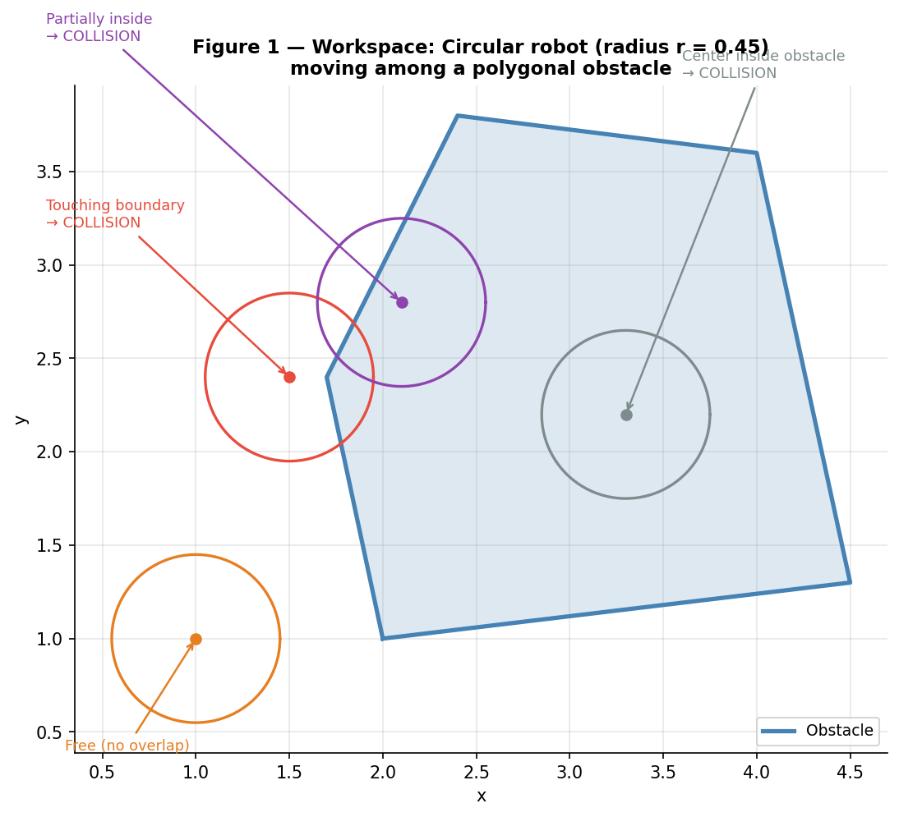
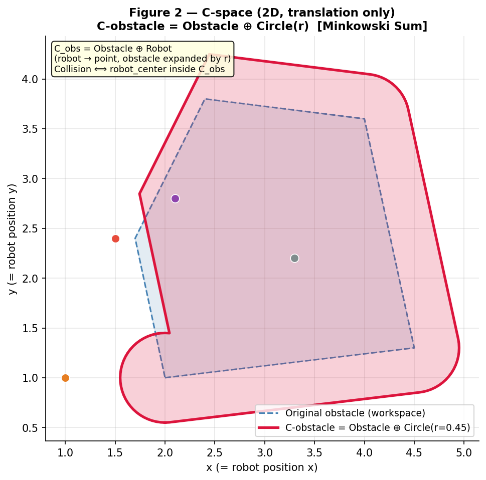
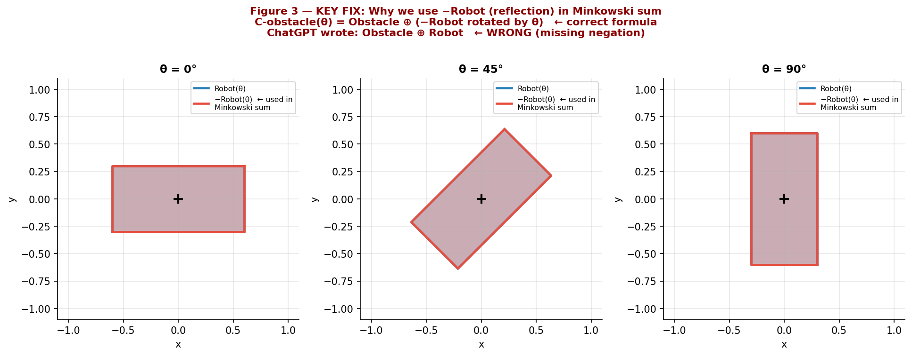
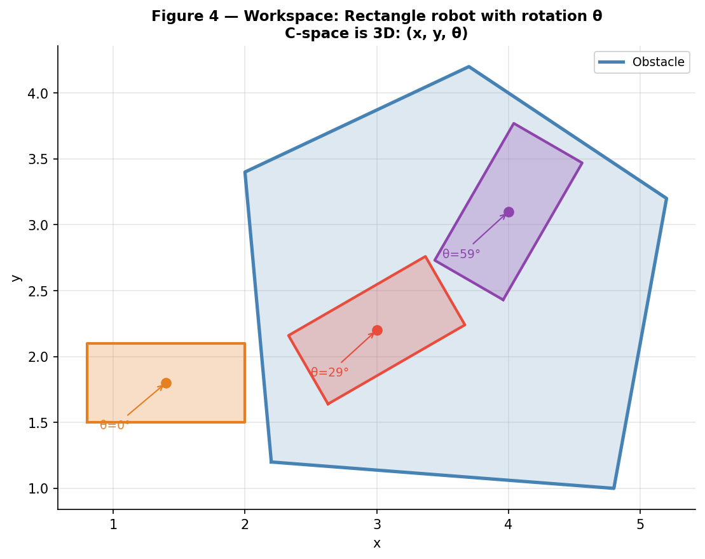
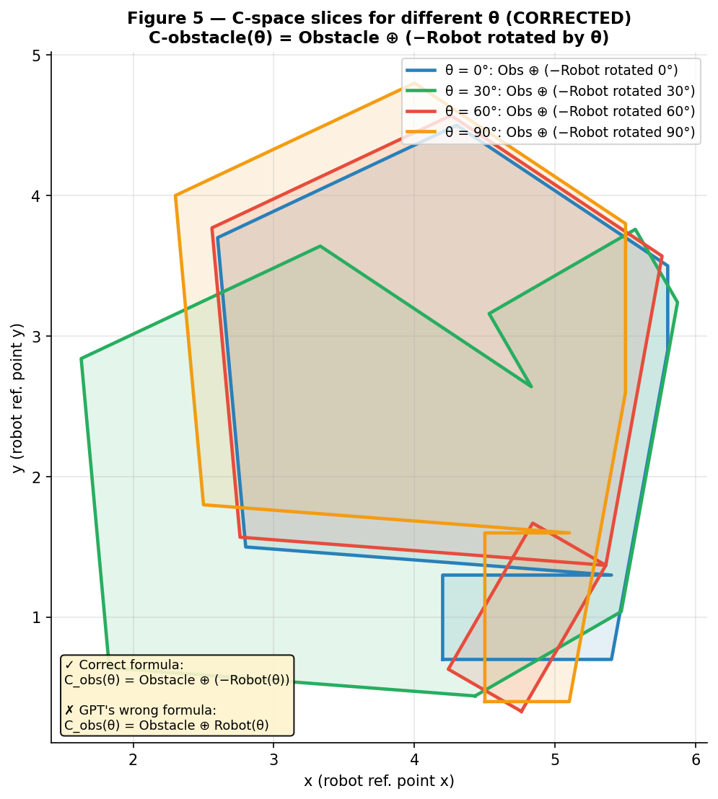
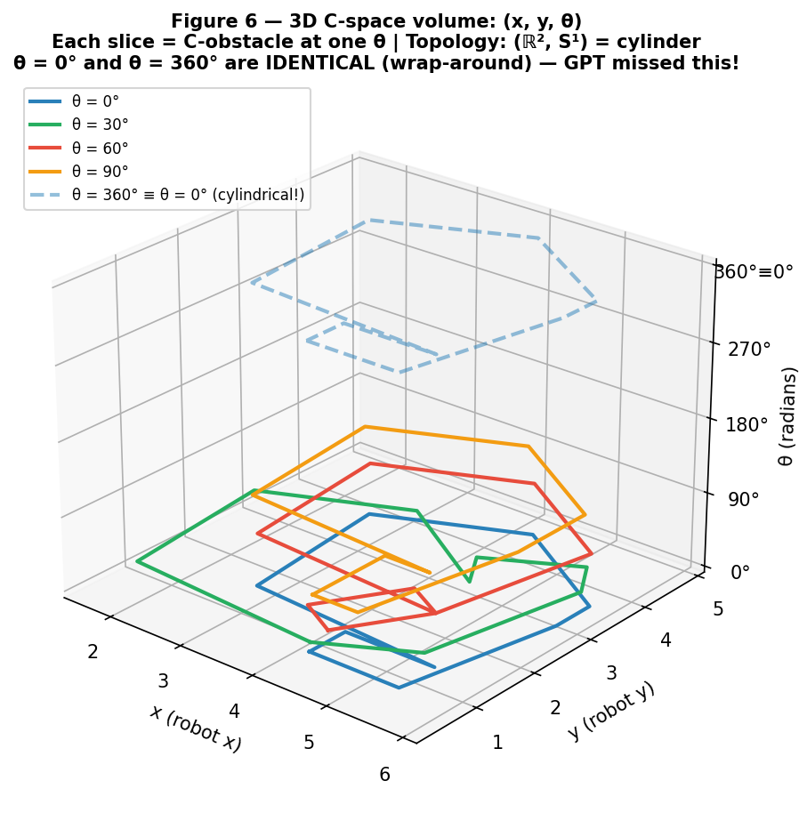

# Patch C-space visualization — Minkowski sum (translation + rotation)

Tài liệu này đi kèm **6 hình** (Figure 1–6) được xuất từ Python code để trả lời đề bài:

> **Draw a sketch of configuration space obstacles** for a simple moving system (robot) with translational and/or rotational degrees of freedom.

## Nội dung patch (những điểm sửa chính)

Để patch code, các vấn đề sau được sửa/nhấn mạnh:

1. **Thêm dấu âm ($-R(\theta)$)** rõ ràng trong visualization (reflection qua gốc tọa độ).
2. **Thêm 3D C-space plot** để minh họa topology dạng **hình trụ** (cylindrical topology) vì $\theta$ là góc quay tuần hoàn.
3. **Annotations** chi tiết hơn cho từng hình (Free/Collision, công thức đúng/sai).
4. **Thêm figure** so sánh trực tiếp $R(\theta)$ vs $-R(\theta)$.

---

## Mô tả chi tiết từng hình

### 📐 Figure 1 — Workspace: Circular robot
**File:** `fig1_workspace_circle.png`

Robot là đĩa tròn bán kính $r = 0.45$. Bốn vị trí được vẽ với màu khác nhau, kèm annotation rõ trạng thái **Free / Collision**.
Đây là “workspace checking” — kiểm tra va chạm ở workspace có thể tốn kém vì phải xét hình robot vs hình vật cản.

---

### 📐 Figure 2 — C-space (2D, Translation only) ✅
**File:** `fig2_cspace_translation.png`

Khi robot chỉ **tịnh tiến** (không quay):

- Robot có thể coi như **điểm tham chiếu** (robot reference point).
- Vật cản được **phình ra** bằng Minkowski sum với hình tròn bán kính $r$:

$$
C_{\text{obs}} = \text{Obstacle} \oplus \text{Circle}(r)
$$

Va chạm xảy ra khi và chỉ khi ($\Leftrightarrow$) tâm robot nằm trong $C_{\text{obs}}$.
Đường dash xanh là obstacle gốc (workspace), đường đỏ là C-obstacle sau khi phình.

---

### 🔴 Figure 3 — KEY FIX: Robot vs $-R(\theta)$ (Reflection)
**File:** `fig3_robot_vs_reflection.png`

**Đây là điểm GPT hay sai nếu bỏ qua dấu âm.** Ba cột ứng với $\theta = 0^\circ, 45^\circ, 90^\circ$:

- **Xanh** = $R(\theta)$ — robot thực tế đã quay
- **Đỏ** = $-R(\theta)$ — phản chiếu qua gốc tọa độ (negation/reflection)

Công thức **đúng**:

$$
C_{\text{obs}}(\theta) = \text{Obstacle} \oplus \left(-R(\theta)\right)
$$

Công thức **sai** (thiếu dấu âm):

$$
C_{\text{obs}}(\theta) = \text{Obstacle} \oplus R(\theta)
$$

**Trực giác vì sao cần dấu âm:**
Ta muốn tập hợp các vị trí reference point sao cho robot **chạm** obstacle. Khi chuyển về bài toán “điểm nằm trong vùng cấm”, ta phải dùng **phản chiếu robot** trong Minkowski sum (tương đương với phép trừ hình học).

---

### 📐 Figure 4 — Workspace: Rectangle robot + Rotation
**File:** `fig4_workspace_rect.png`

Robot là hình chữ nhật và có quay $\theta$. Ba pose ($\theta = 0^\circ, 30^\circ, 60^\circ$) được vẽ.

Điểm quan trọng: trạng thái va chạm **phụ thuộc $\theta$** — cùng $(x, y)$ nhưng $\theta$ khác nhau có thể **Free** hoặc **Collision**.
-> Vì vậy C-space **phải là 3D**: $(x, y, \theta)$.

---

### 📐 Figure 5 — C-space Slices (CORRECTED)
**File:** `fig5_cspace_slices_corrected.png`

Vẽ các lát (slice) của C-obstacle ứng với nhiều giá trị $\theta$ ($0^\circ, 30^\circ, 60^\circ, 90^\circ$):

$$
C_{\text{obs}}(\theta) = \text{Obstacle} \oplus \left(-R(\theta)\right)
$$

Mỗi $\theta$ tạo ra một biên cấm khác nhau trên mặt phẳng $(x, y)$.
Các slice không chỉ “to hơn/nhỏ hơn” đơn giản — hình dạng thay đổi theo hướng quay.

---

### 🌐 Figure 6 — 3D C-space (Cylindrical Topology)
**File:** `fig6_3d_cspace_cylindrical.png`

Không gian cấu hình đầy đủ là:

- Trục `x, y`: vị trí robot
- Trục $\theta$: góc quay (tuần hoàn)

Vì $\theta$ là góc nên:

$$
\theta = 0^\circ \equiv \theta = 360^\circ
$$

Do đó topology đúng là $(\mathbb{R}^2, S^1)$ — tương đương **hình trụ** (cylinder) vô hạn theo $x, y$ và **khép kín** theo $\theta$.
Trong hình, đường đứt tại $\theta = 360^\circ$ cho thấy wrap-around về $\theta = 0^\circ$.

---

## Nội dung trong ZIP

- `fig1_workspace_circle.png`
- `fig2_cspace_translation.png`
- `fig3_robot_vs_reflection.png`
- `fig4_workspace_rect.png`
- `fig5_cspace_slices_corrected.png`
- `fig6_3d_cspace_cylindrical.png`
- `README.md` (file này)
