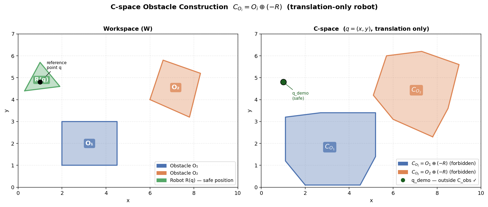
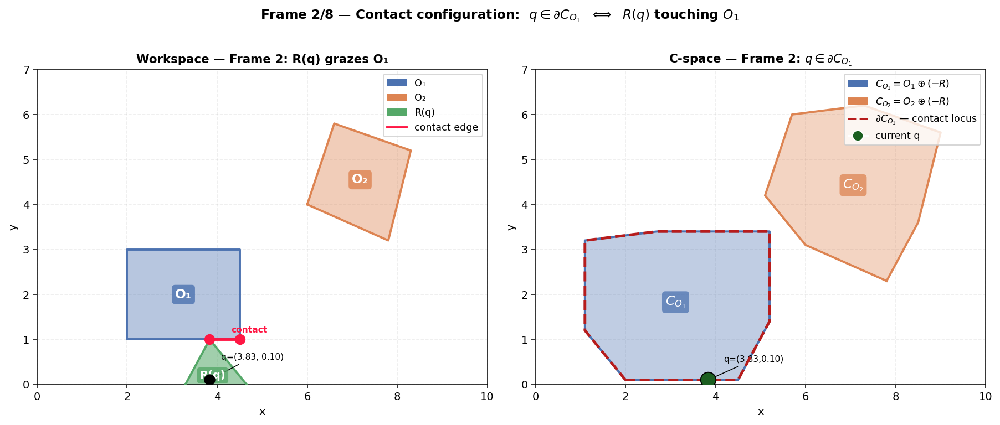
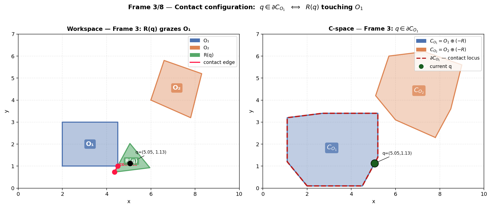
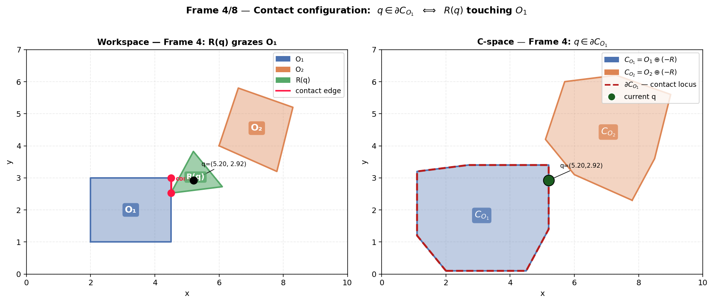
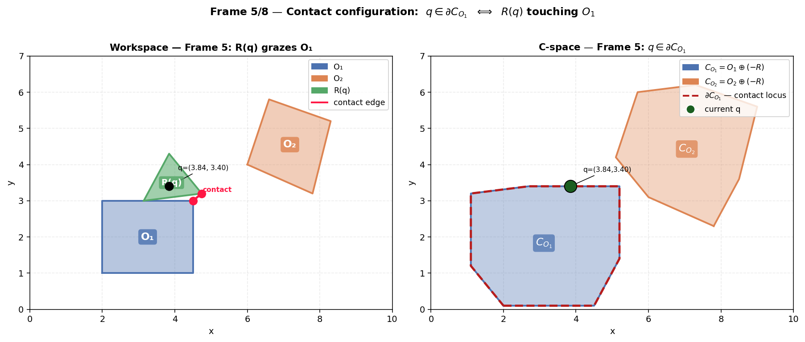
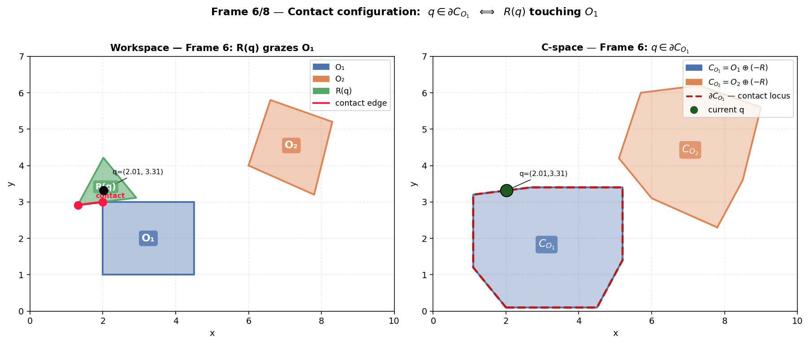
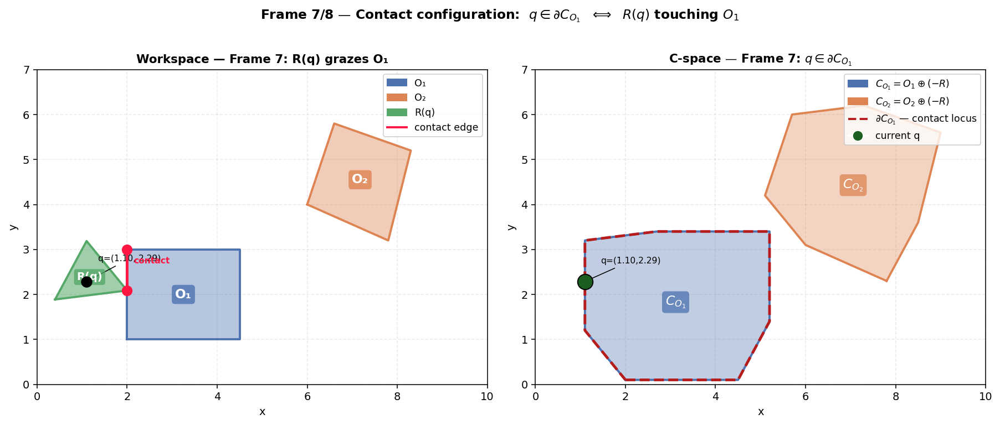
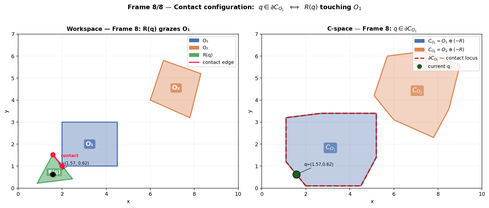
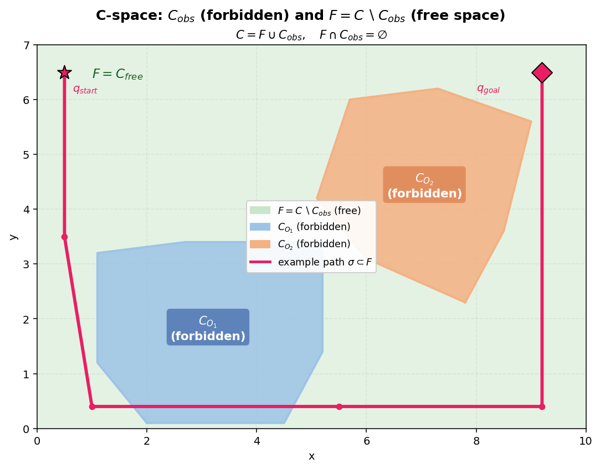

# Define configuration space obstacle sets $C_{O_i}$ and free space $F$ — images + explanation

Gói này đi kèm **10 ảnh** (1 overview + 8 contact frames + 1 free-space plot) cho đề:

> **Define sets like configuration space obstacles $C_{O_i}$ and freespace $F$**

Robot: **translation-only** (không quay), cấu hình $q=(x,y)$.

---

## Những gì đã được fix so với code gốc

1) **Minkowski sum algorithm**  
Thay vì `convex_hull(pairwise sums)` (đúng nhưng tốn kém và dễ bị coi là “xấp xỉ”), bản patched dùng **edge-vector merge algorithm** cho Minkowski sum **exact** khi cả hai polygon đều **lồi**.

2) **Free space visualization**  
Nền $F$ được **fill** màu xanh lá rõ, sau đó overlay các vùng cấm $C_{\text{obs}}$ lên trên -> trực quan hơn.

3) **Contact annotation**  
Mỗi frame vẽ đường đỏ “contact edge” nối các đỉnh gần nhất giữa $R(q)$ và $O_1$ -> giúp thấy rõ “touching/grazing” thực sự.

4) **Boundary highlighting**  
Trong C-space, biên $\partial C_{O_1}$ được vẽ nét đứt đỏ để nhấn mạnh “contact locus”.

5) **Example path** $\sigma(t)\subset F$  
Thêm đường đi mẫu hợp lệ trong hình free space để hoàn chỉnh câu chuyện motion planning.

---

## Cơ sở toán học (đúng cho translation-only)

### Định nghĩa C-space obstacles theo từng vật cản
$$
C_{O_i} = \{q\in C \mid (R+q)\cap O_i \neq \emptyset\}
$$
Với robot chỉ tịnh tiến và robot được neo tại gốc (reference), ta có:
$$
C_{O_i} = O_i \oplus (-R)
$$
Trong đó $-R$ là robot phản xạ qua gốc.

### Vùng cấm tổng và free space
$$
C_{\text{obs}} = \bigcup_i C_{O_i}, \qquad
F = C \setminus C_{\text{obs}}
$$
$$
C = F \cup C_{\text{obs}}, \qquad F\cap C_{\text{obs}}=\emptyset
$$

---

## Description từng ảnh

### Fig 1 — Overview (workspace vs C-space)
**File:** `fig1_overview.png`

Hai panel song song:

- **Trái (Workspace W):**  
  - $O_1$ (xanh dương), $O_2$ (cam) là các vật cản.
  - Robot $R(q)$ (xanh lá) đang ở vị trí an toàn (`q_demo`).
  - Chấm đen là **reference point** $q$.

- **Phải (C-space):**  
  - $C_{O_1}=O_1\oplus(-R)$ và $C_{O_2}=O_2\oplus(-R)$ là các vùng cấm tương ứng.
  - $q_{\text{demo}}$ nằm ngoài cả hai vùng -> **safe**.

---

### Fig 2–9 — 8 contact frames (contact locus)
Các frame minh hoạ equivalence quan trọng:

$$
q\in \partial C_{O_1} \quad \Longleftrightarrow \quad R(q)\ \text{touching}\ O_1
$$

Trong **mỗi frame**:
- **Workspace (trái):** robot $R(q)$ chạm $O_1$. Đường đỏ nối cặp điểm/đỉnh gần nhất để highlight “contact”.
- **C-space (phải):** điểm $q$ nằm trên biên $\partial C_{O_1}$ (đường đỏ nét đứt). Chấm xanh đậm là $q$ hiện tại.

**Fig 2 — Frame 1/8**
**File:** `fig2_frame1.png`

**Fig 3 — Frame 2/8**
**File:** `fig3_frame2.png`

**Fig 4 — Frame 3/8**
**File:** `fig4_frame3.png`

**Fig 5 — Frame 4/8**
**File:** `fig5_frame4.png`

**Fig 6 — Frame 5/8**
**File:** `fig6_frame5.png`

**Fig 7 — Frame 6/8**
**File:** `fig7_frame6.png`

**Fig 8 — Frame 7/8**
**File:** `fig8_frame7.png`

**Fig 9 — Frame 8/8**
**File:** `fig9_frame8.png`

---

### Fig 10 — Free space $F = C\setminus C_{\text{obs}}$
**File:** `fig10_freespace.png`

- Nền xanh lá: $F$ (free space).
- Hai vùng đậm: $C_{O_1}$, $C_{O_2}$ (forbidden).
- Đường hồng: ví dụ đường đi $\sigma(t)\subset F$ từ $q_{\text{start}}$ đến $q_{\text{goal}}$, không cắt vùng cấm.

---

## Lưu ý quan trọng

- Các thuật toán Minkowski sum ở đây là **exact** khi mọi polygon đều **lồi**.  
  Nếu obstacle/robot **phi lồi**, cần xử lý decomposition hoặc thuật toán khác.
- Trong các contact frames, một số sai lệch thị giác rất nhỏ có thể do floating-point khi đặt điểm $q$ đúng trên biên.

---

## Nội dung trong ZIP

- `README.md` (file này)
- `fig1_overview.png`
- `fig2_frame1.png` … `fig9_frame8.png`
- `fig10_freespace.png`
