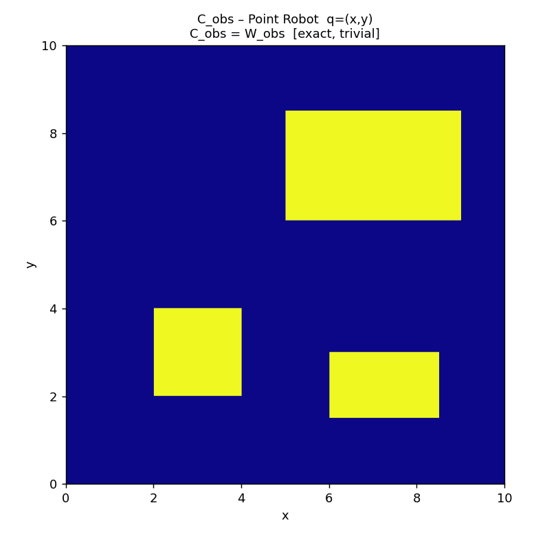
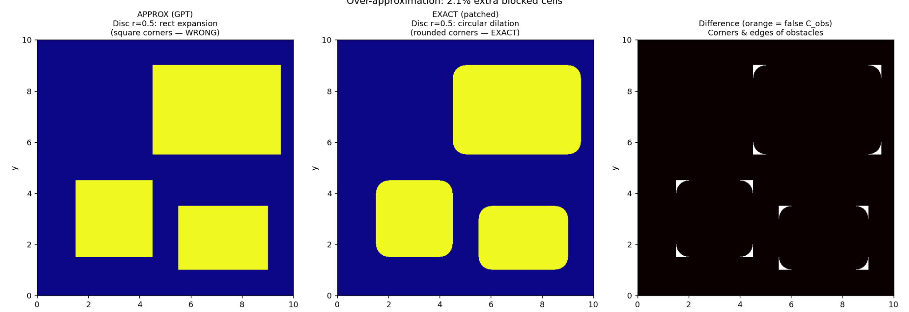
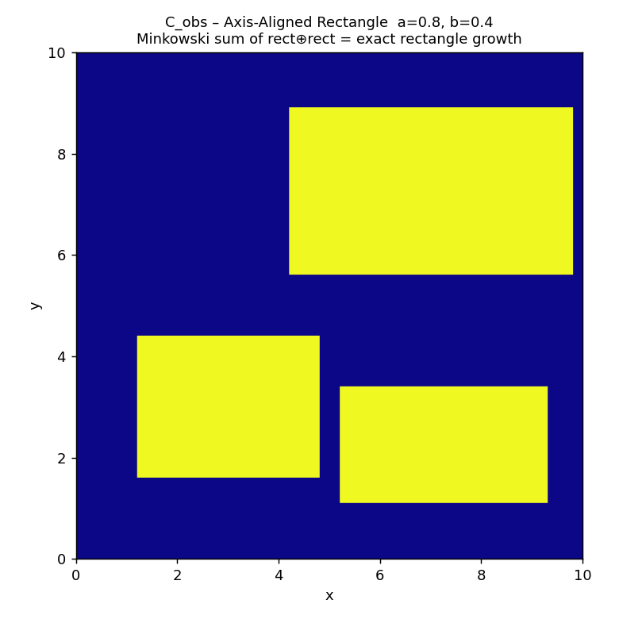
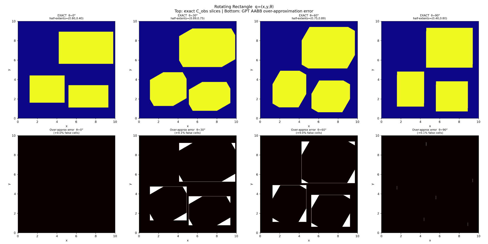
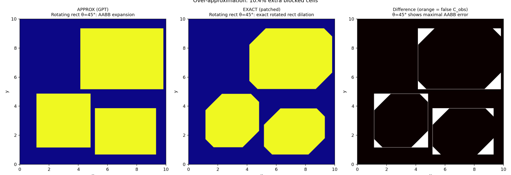

# Formulate C-space representations for different robot types — patched (binary dilation)

Gói này tổng hợp **các hình Claude chạy từ Python** cho đề bài:

> **Formulate the representation for different robot types in configuration space**

Trọng tâm là phân biệt giữa:
- **xấp xỉ AABB / rect expansion (conservative over-approximation)** và
- **tính đúng Minkowski sum** bằng **`scipy.ndimage.binary_dilation`** với structuring element có hình dạng robot.

---

## Vấn đề cốt lõi cần fix

| Robot | GPT (sai / xấp xỉ) | Exact (patched) |
|-------|---------------------|-----------------|
| **Disc** | Mở rộng rectangle vuông góc -> **góc vuông** | **Rounded corners** - dùng circular structuring element |
| **Rotating rectangle** | AABB theo $\theta$ (over-approx) | **Exact rotated-rectangle mask** via binary dilation |

**Cách fix:** dùng `binary_dilation(W_mask, structure=robot_struct)`  
-> đây chính là Minkowski sum rời rạc (grid-based) của $W_{\text{obs}} \oplus (-R)$.

---

## Đánh giá code của GPT (review ngắn)

### ✅ Phần đúng

1) **Point robot** — chính xác:
$$
\mathcal{C}_{\text{obs}} = \mathcal{W}_{\text{obs}}
$$

2) **Disc robot (r = 0.5)** — đúng ý tưởng Minkowski sum; nhưng nếu thay bằng “rect expansion” thì chỉ còn là **xấp xỉ**.

3) **Axis-aligned rectangle** — ✅ **exact**:
$$
[x_1-a,\;x_2+a] \times [y_1-b,\;y_2+b]
$$

4) **AABB half-extents cho rotating rectangle** — công thức GPT dùng là đúng:
$$
h_x=a|\cos\theta|+b|\sin\theta|,\quad h_y=a|\sin\theta|+b|\cos\theta|
$$
Nhưng bản chất vẫn là **over-approximation**, không phải exact C-space.

### ⚠️ Điểm cần lưu ý

- Rotating rectangle dùng AABB làm C-space sẽ **phình quá mức** (cấm oan vùng đi được).
- Disc robot “bo góc” là bản chất hình học đúng; giữ góc vuông chỉ là xấp xỉ.

---

## Giải thích từng hình (images)

### Fig 1 — Point Robot (không đổi)
**File:** `fig1_point_robot.png`

- Point robot: cấu hình $q=(x,y)$.
- C-obstacle đúng bằng workspace obstacle: $\mathcal{C}_{\text{obs}}=\mathcal{W}_{\text{obs}}$.
- Đây là trường hợp “trivial / exact”.

---

### Fig 2 — Disc Robot: GPT vs Exact ⭐ (Sai quan trọng nhất)
**File:** `fig2_disc_comparison.png`

- **APPROX (GPT):** mở rộng hình chữ nhật thêm $r$ theo 4 hướng -> **giữ góc vuông** (square corners).
- **EXACT (patched):** dilation bằng **đĩa tròn** bán kính $r$ -> **góc bo tròn** (rounded corners) đúng theo Minkowski sum.
- **Difference (orange):** vùng GPT coi là $C_{\text{obs}}$ nhưng thực tế disc robot vẫn đi được -> bị “cấm oan”.

---

### Fig 3 — Axis-aligned Rectangle (GPT đã đúng)
**File:** `fig3_rect_aligned.png`

- Robot là rectangle axis-aligned với half-sizes $a=0.8, b=0.4$.
- Minkowski sum $\text{rect} \oplus \text{rect}$ cho ra đúng rectangle growth -> không có over-approximation.

---

### Fig 4 — Rotating Rectangle: $\theta = 0^\circ, 30^\circ, 60^\circ, 90^\circ$
**File:** `fig4_rotating_rect_exact.png`

- Robot quay -> cấu hình $q=(x,y,\theta)$.
- **Hàng trên:** $C_{\text{obs}}$ slice **EXACT** cho từng $\theta$ (dùng rotated-rectangle structuring element).
- **Hàng dưới:** **Over-approx error** = (AABB GPT) $\setminus$ (EXACT).  
  Đây là phần “false obstacles” do AABB phình.
- Nhận xét thường thấy:
  - $\theta$ gần $0^\circ/90^\circ$: AABB gần khít -> lỗi nhỏ.
  - $\theta$ trung gian ($30^\circ/60^\circ$): AABB phình mạnh -> lỗi lớn.

---

### Fig 5 — $\theta = 45^\circ$ (worst case cho AABB)
**File:** `fig5_rotate45_comparison.png`

- $45^\circ$ thường là trường hợp AABB “phình” rõ nhất.
- So sánh side-by-side:
  - **APPROX (GPT):** AABB expansion.
  - **EXACT (patched):** rotated-rectangle dilation.
  - **Difference:** vùng sai nổi bật ở 4 góc mỗi obstacle.

---

## Nội dung trong ZIP

- `fig1_point_robot.png`
- `fig2_disc_comparison.png`
- `fig3_rect_aligned.png`
- `fig4_rotating_rect_exact.png`
- `fig5_rotate45_comparison.png`
- `README.md` (file này)
