# Construct C-space obstacles (translation only) — Minkowski sum + sweep visualization

Gói này chứa **17 ảnh** minh hoạ bài:

> **Construct configuration space obstacles for translational degrees of freedom and know the underlying concepts**

Trọng tâm: với robot **chỉ tịnh tiến** (không quay), vùng cấm trong C-space được biểu diễn bởi:

$$
\mathcal{C}_{\text{obs}} = \{ q \mid (R+q)\cap O \neq \emptyset \} = O \oplus (-R)
$$

Trong đó:
- $O$ là vật cản trong workspace (đa giác),
- $R$ là robot (đa giác) đặt tại gốc (reference),
- $-R = \{-r \mid r\in R\}$ là robot phản xạ qua gốc,
- $O \oplus (-R)$ là Minkowski sum, tạo ra C-space obstacle cho **reference point** của robot.

---

## Validation: GPT's explanation và code về C-space obstacles

### ✅ Lý thuyết — Đúng hoàn toàn

- Định nghĩa $C_{\text{obs}} = \{q \mid (R+q)\cap O \neq \emptyset\}$ ✓  
- Chứng minh lõi: va chạm $\Leftrightarrow \exists r\in R,\; \exists o\in O:\; r+q=o \Rightarrow q=o-r \Rightarrow C_{\text{obs}}=O\oplus(-R)$ ✓  
- Các trường hợp đặc biệt (robot điểm, hình tròn, đa giác lồi) đều đúng ✓  
- Lưu ý quan trọng “chỉ đúng khi không có quay” được nêu rõ ✓  

### ✅ Code — Đúng về mặt thuật toán

| Hàm | Đánh giá |
|-----|----------|
| `reflect(P)` → `-P` | ✓ Phản xạ qua gốc |
| `minkowski_sum_convex` = pairwise sums + convex hull | ✓ Đúng (với convex shapes) |
| `convex_hull` (monotonic chain) | ✓ Cài đặt chuẩn |
| `sample_boundary` để minh hoạ sweep | ✓ Đúng mục đích |

**Ghi chú nhỏ:** thuật toán dùng $O(n\cdot m)$ pairwise sums thay vì merge $O(n+m)$ tối ưu cho đa giác lồi. Với bài minh hoạ thì ổn.

### ✅ Images — Kiểm tra từng nhóm hình

- **img1 (Workspace):** 1 robot reference + 3 cấu hình q, phân biệt rõ free/collision.  
- **img2 (Reflect):** -R là phản xạ đúng của R qua gốc.  
- **img3 (C_obs):** $C_{\text{obs}}$ (hull) lớn hơn $O$, đúng với “nở vật cản”.  
- **img4–img7 (Iterations):** tăng dần đỉnh của O, hull mở rộng dần — trực quan, hợp logic.  
- **img8–img17 (Sweep frames):** $-R$ trượt theo biên $O$; tập vị trí origin của $-R$ tạo biên $C_{\text{obs}}$ — minh hoạ rất mạnh.

### ⚠️ Lưu ý nhỏ (đã được patch)

Trong bản “gốc”, dễ nhầm R tại origin là một cấu hình robot như các q. Patch ở đây đã:
- R tại origin: **màu riêng, nét đứt (reference)**,
- robot tại q: **màu khác + ký hiệu ✓/✗ + hatch khi collision**,
- legend/annotation rõ ràng.

---

## Tóm tắt các patch và mô tả chi tiết từng ảnh

### Các vấn đề đã fix so với code gốc

**Bug chính (img1):** Code gốc vẽ R tại origin cùng màu với một trong các q → dễ gây nhầm.  
Fix: R gốc dùng màu riêng (cam, nét đứt), 3 vị trí q dùng 3 màu khác nhau + ký hiệu ✓/✗ + hatch khi collision.

**Thiếu thông tin (nhiều ảnh):** không rõ điểm nào là gì.  
Fix: thêm legend, fill màu bán trong suốt, annotate tọa độ.

**Sweep frames thiếu context:** không thấy “trail” các vị trí trước đó.  
Fix: thêm trail mờ của tất cả vị trí −R trước đó.

---

## Mô tả từng ảnh

### img1 — Workspace
**File:** `img1_workspace.png`

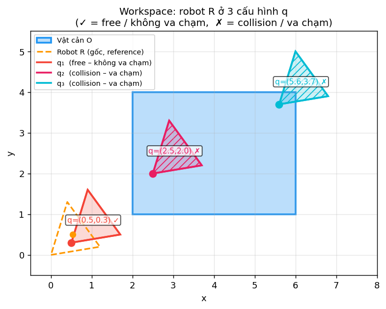

- Vật cản **O**: hình chữ nhật xanh (fill nhạt).
- **Robot R tại origin**: cam, nét đứt (reference).
- Ba cấu hình:
  - $q_1=(0.5,0.3)$ **✓** (đỏ) — không va chạm.
  - $q_2=(2.5,2.0)$ **✗** (hồng) — va chạm (hatch).
  - $q_3=(5.6,3.7)$ **✗** (cyan) — va chạm (hatch).
- Dấu chấm tại q là **reference point**.

---

### img2 — Reflect (R và −R)
**File:** `img2_reflect.png`

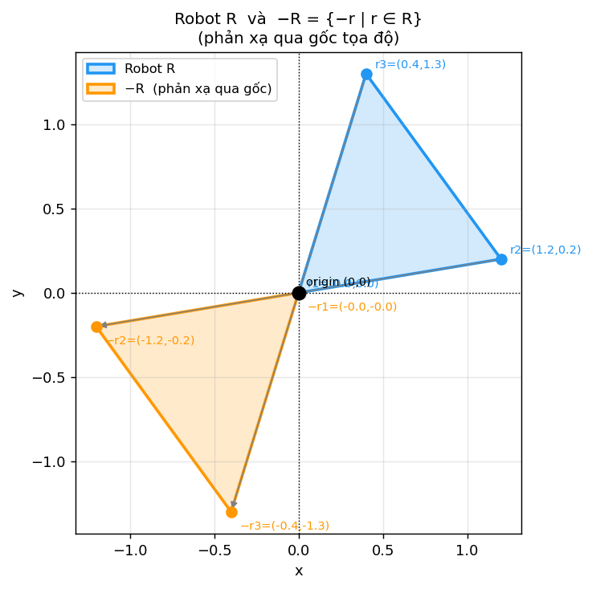

- Tam giác xanh: $R$.
- Tam giác cam: $-R$ (phản xạ qua gốc).
- Mũi tên nối từng đỉnh $r_i \to -r_i$, thấy rõ phép $(x,y)\mapsto(-x,-y)$.
- Có trục toạ độ đi qua gốc để trực quan hóa reflection.

---

### img3 — C_obs hull = $O \oplus (-R)$
**File:** `img3_cobs_hull.png`

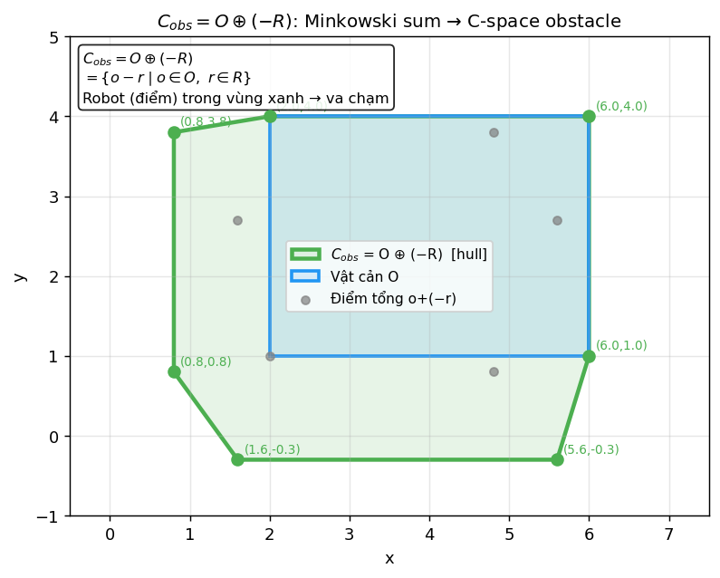

- Vùng xanh lá nhạt: $C_{\text{obs}} = O \oplus (-R)$ (convex hull).
- Vùng O (xanh dương) nằm bên trong.
- Chấm xám: các điểm tổng $o + (-r)$.
- Các đỉnh hull được label toạ độ.
- Ý nghĩa: **robot (điểm) rơi vào vùng $C_{\text{obs}}$** $\Leftrightarrow$ robot thật va chạm với $O$.

---

### img4–img7 — Iterations 1–4 (xây hull tăng dần theo số đỉnh O)
**Files:** `img4_iter1.png`, `img5_iter2.png`, `img6_iter3.png`, `img7_iter4.png`

- Mỗi iter thêm một đỉnh $o_i$ của $O$, tính các điểm tổng với $-R$, rồi build convex hull.
- Hull partial màu xanh lá (fill nhạt); “C_obs cuối” hiển thị nét chấm mờ để so sánh.
- Đây là minh hoạ trực quan cho ý tưởng: **C_obs là hull của tất cả tổng $o + (-r)$**.

**img4 — Iteration 1/4**
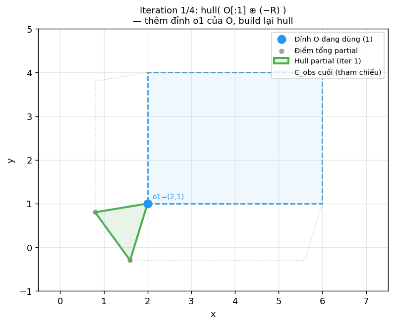

**img5 — Iteration 2/4**
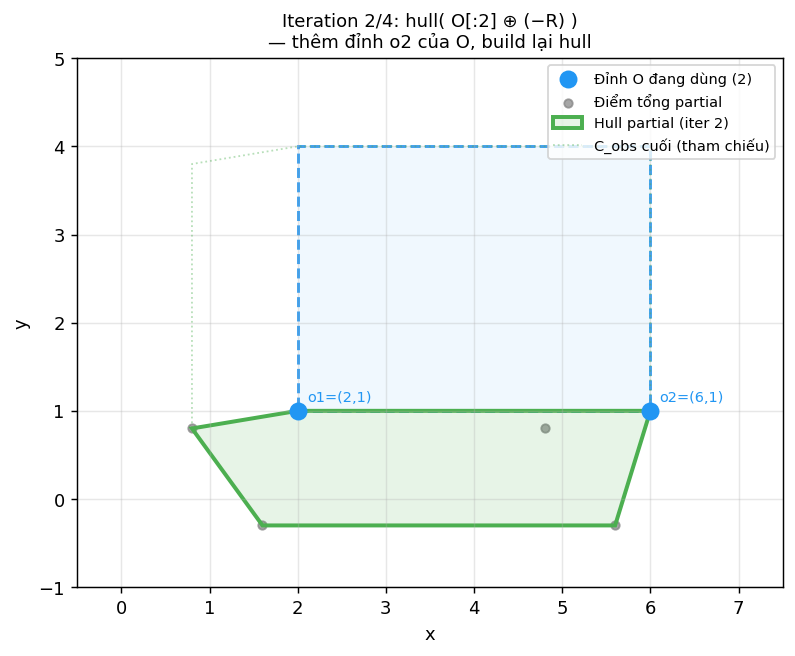

**img6 — Iteration 3/4**
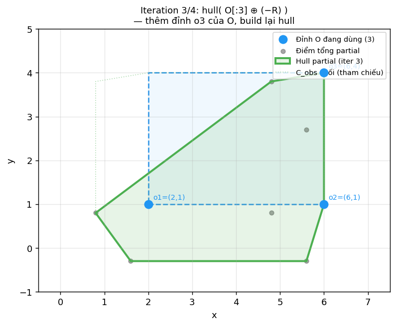

**img7 — Iteration 4/4**
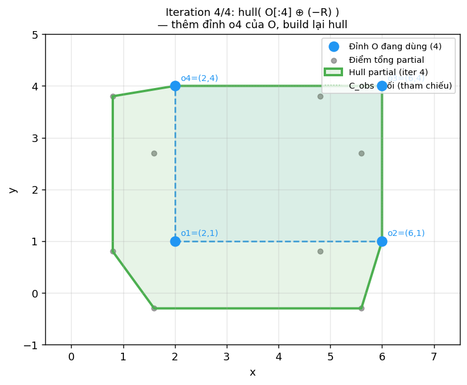

---

### img8–img17 — Sweep frames 1–10 (−R trượt theo biên O)
**Files:** `img8_sweep01.png` … `img17_sweep10.png`

Ý tưởng sweep:
- Giữ $C_{\text{obs}}$ (xanh lá) cố định.
- Đặt $-R$ (tím) sao cho **origin của -R** nằm tại các điểm trên biên $O$ (lấy mẫu theo biên).
- Tập hợp các vị trí origin của $-R$ khi trượt quanh biên $O$ sẽ “vẽ ra” **biên của $C_{\text{obs}}$**.

Các frame:
- Frame hiện tại: -R fill tím đậm hơn.
- Các frame trước: trail mờ để thấy quá trình trượt.
- Chấm đen: điểm biên $q$ đang xét.

**img8 — Sweep frame 1/10**
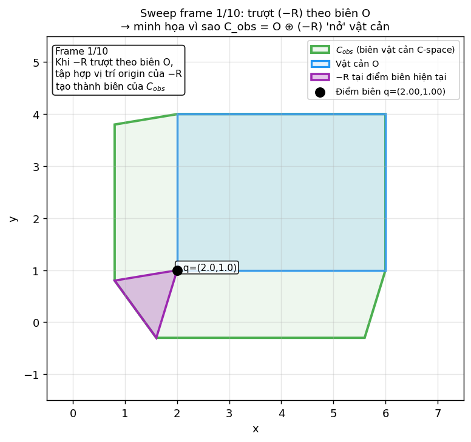

**img9 — Sweep frame 2/10**
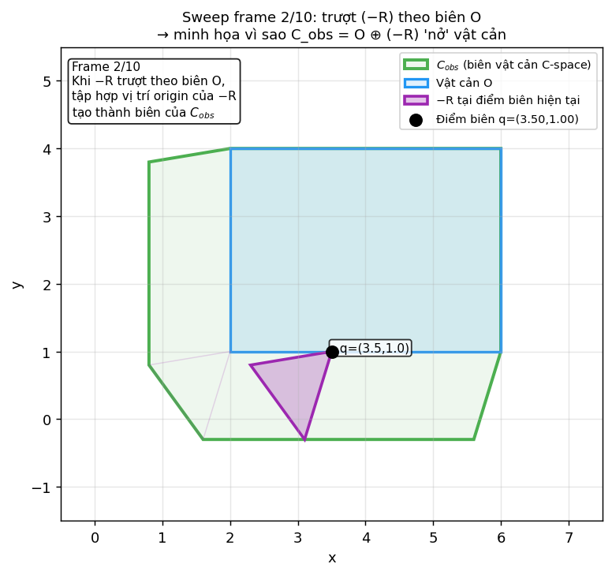

**img10 — Sweep frame 3/10**
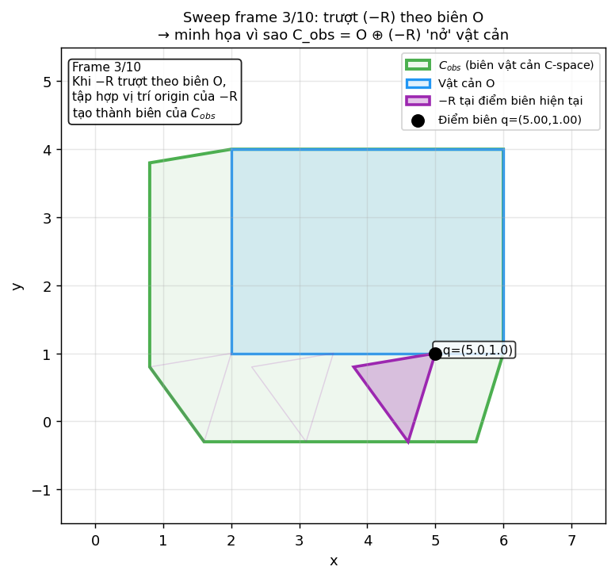

**img11 — Sweep frame 4/10**
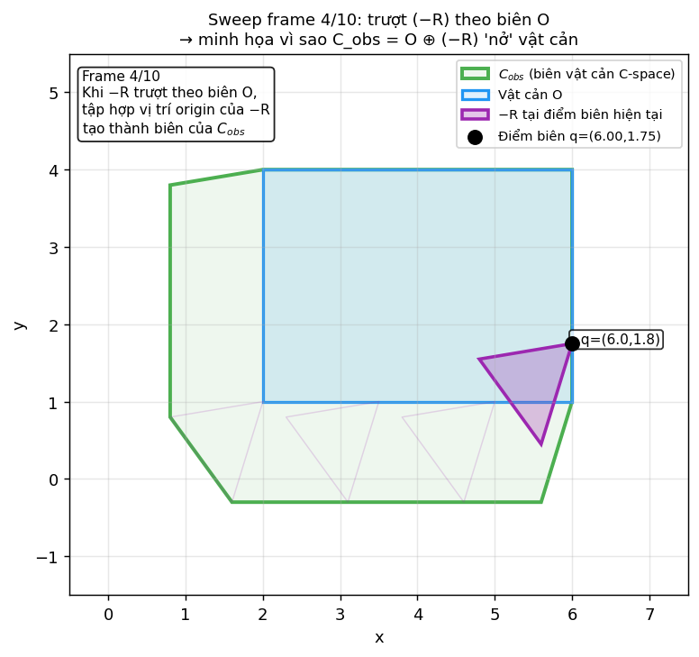

**img12 — Sweep frame 5/10**
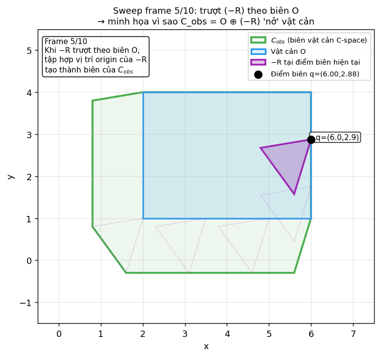

**img13 — Sweep frame 6/10**
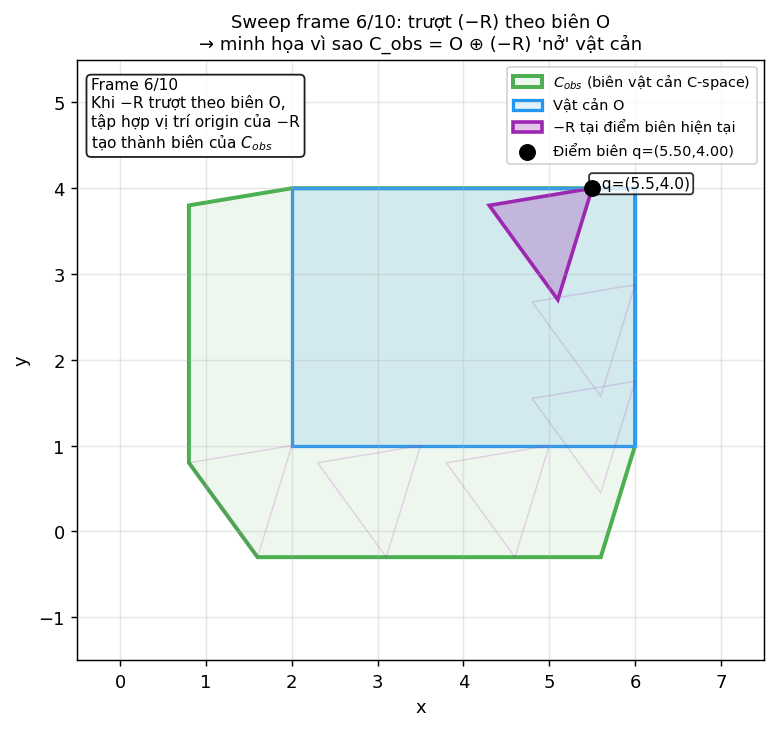

**img14 — Sweep frame 7/10**
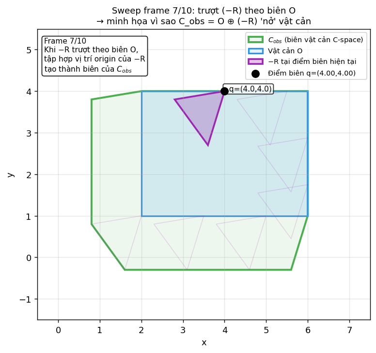

**img15 — Sweep frame 8/10**
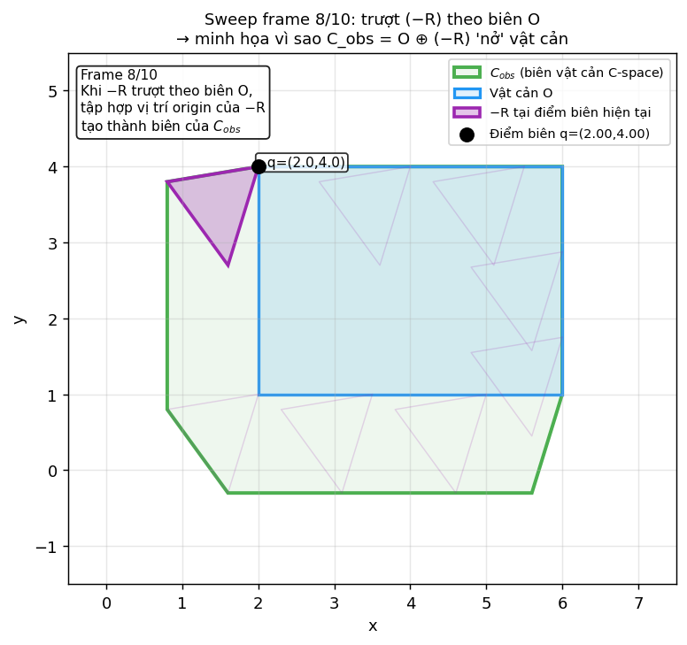

**img16 — Sweep frame 9/10**
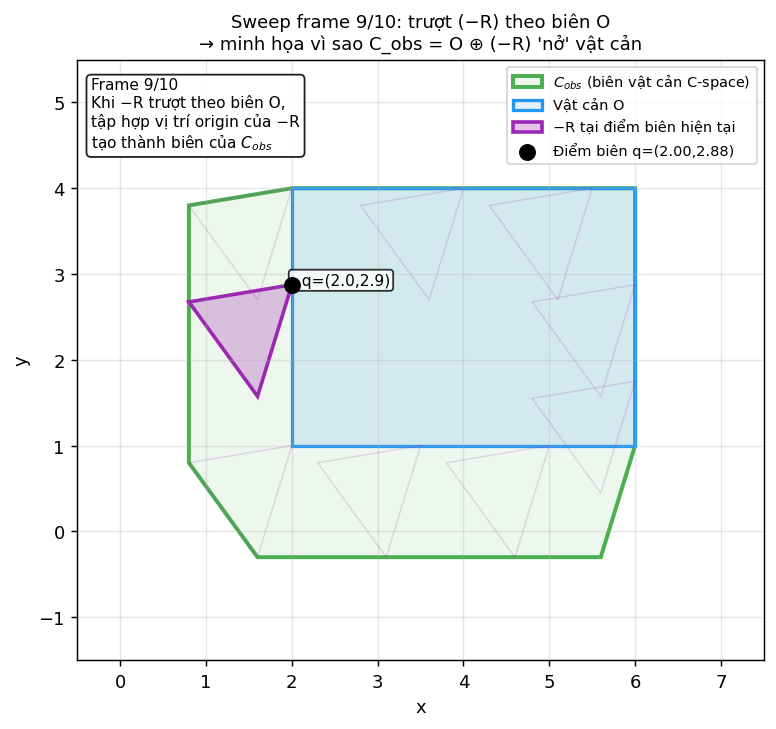

**img17 — Sweep frame 10/10**
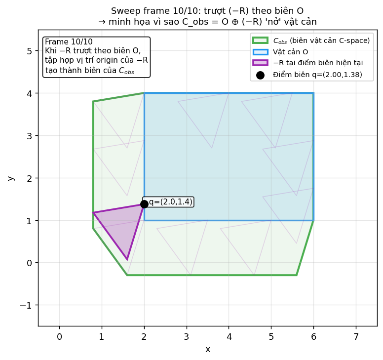

---

## Nội dung trong ZIP

- `README.md` (file này)
- `img1_workspace.png`
- `img2_reflect.png`
- `img3_cobs_hull.png`
- `img4_iter1.png` … `img7_iter4.png`
- `img8_sweep01.png` … `img17_sweep10.png`
