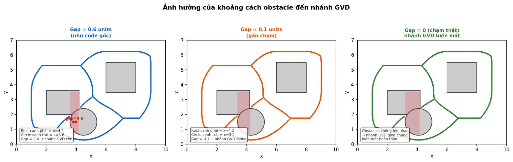

# Ảnh hưởng của khoảng cách obstacle đến nhánh GVD (Gap → GVD branch)

Gói này gồm **1 hình minh hoạ (3 panel)** + **README.md** giải thích ý nghĩa hình theo đúng logic hình học của GVD.

## Ý chính

```
Khe hở còn dù 1mm  →  GVD vẫn tồn tại ở giữa khe đó
Khe hở = 0 (chạm thật)  →  nhánh GVD đó biến mất
```

GVD (Generalized Voronoi Diagram) được tạo bởi các điểm trong free space mà **có khoảng cách bằng nhau đến ít nhất 2 biên vật cản**. Vì thế:

- Nếu vẫn còn free space giữa hai vật cản (gap > 0) → vẫn tồn tại tập điểm “cách đều” → **nhánh GVD vẫn còn** (dù có thể rất ngắn/mỏng).
- Nếu hai vật cản chạm nhau/đè lên nhau (gap = 0 hoặc overlap) → free space giữa chúng **biến mất** → không còn điểm cách đều ở giữa → **nhánh GVD biến mất**.

---

## Hình minh hoạ (3 trường hợp)

**File:** `gvd_gap_three_cases.png`



### Panel trái — Gap ≈ 0.6 units (như code gốc)
- Nhìn bằng mắt *có thể tưởng* hình chữ nhật và hình tròn chạm nhau.
- Nhưng theo toạ độ thực, vẫn còn khe hở **gap = 0.6** → nhánh GVD chạy qua giữa còn rõ.

### Panel giữa — Gap ≈ 0.1 units (gần chạm)
- Khe hở rất nhỏ → nhánh GVD vẫn tồn tại, nhưng bị “ép” lại → **ngắn/mỏng**.

### Panel phải — Gap = 0 (chạm thật) / overlap
- Khi hai vật cản **chạm/đè** → không còn free space ở giữa.
- Nhánh GVD “giữa khe” **biến mất hoàn toàn**, chỉ còn các nhánh khác.

---

## Sơ đồ trực giác (ASCII)

### Khi còn khe hở:
```
Obstacle A          Obstacle B
  ████               ████
  ████   ←  GVD  →   ████
  ████    (giữa)     ████
```

### Khi chạm thật / overlap:
```
  ████████████████████████
  ████████████████████████   ← không còn free space ở giữa
                              → nhánh GVD biến mất
```

---

## “Trông có vẻ chạm” vs “chạm thật” bằng số

Ví dụ:

- HCN `(2.0, 2.0, 2.2, 1.6)` ⇒ cạnh phải `x = 2.0 + 2.2 = 4.2`
- Tròn: tâm `(4.5, 1.5)`, bán kính `r = 0.9` ⇒ biên trái `x = 4.5 - 0.9 = 3.6`

Khoảng cách theo trục x là:

\[
gap = 4.2 - 3.6 = 0.6
\]

→ **Không chạm**, chỉ là cảm giác do tỉ lệ/độ dày nét vẽ.

> GVD không “nhìn bằng mắt”. GVD phản ứng với **khoảng cách hình học thật**.

---

## Gợi ý tạo 3 trường hợp trong code (nếu muốn tự kiểm chứng)

Giữ `r = 0.9` và cạnh phải HCN `x = 4.2`, điều chỉnh `circle_center_x` để đạt gap mong muốn:

- Gap ≈ 0.6: `circle_center_x = 4.5`
- Gap ≈ 0.1: `circle_center_x = 4.2 + 0.9 - 0.1 = 5.0`
- Gap = 0: `circle_center_x = 4.2 + 0.9 = 5.1`

---

## Nội dung trong ZIP

- `gvd_gap_three_cases.png`
- `README.md` (file này)
