# PRM Variants (Phần mở rộng) — Adaptive PRM & Lazy PRM\*

> **Cách preview:** mở file này bằng Markdown preview (VS Code / Obsidian / GitHub).  
> Các ảnh nằm trong thư mục `images/` nên link **tương đối** sẽ không lỗi.

---

## 🟠 Adaptive PRM — “Sampling có não”

### A1 — Step 0: Initial Density Map (Uniform + boundary bias)

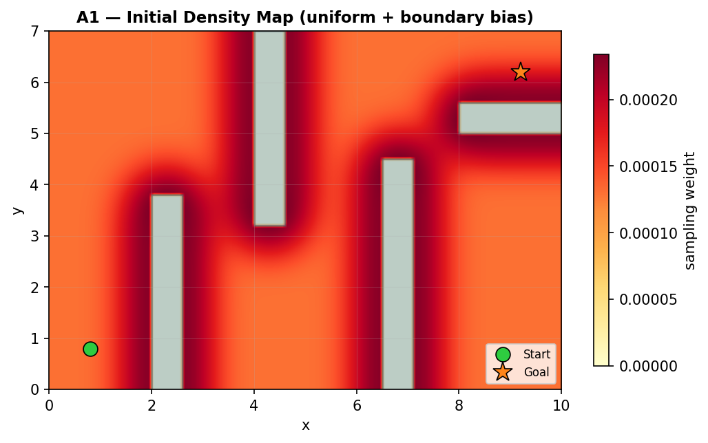

- Heatmap: **màu càng nóng/đậm => sampling weight càng cao => lấy mẫu nhiều hơn**.
- Khởi tạo có **boundary bias**: vùng gần biên obstacle được boost trước để tăng khả năng tìm narrow passage.

---

### A2 — Iteration 1/4 (Samples -> Roadmap/Collisions -> Updated density)

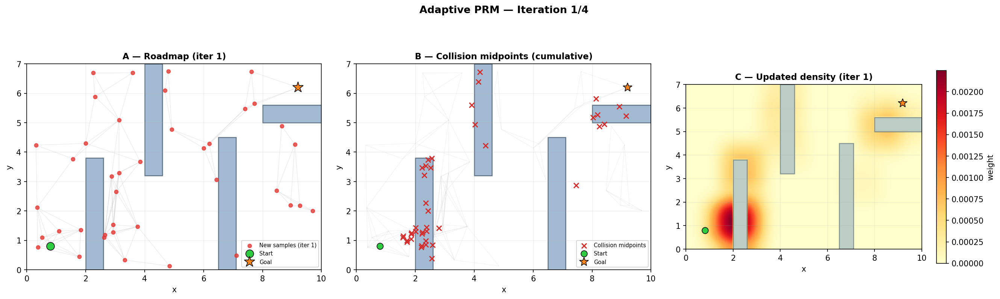

- **Panel A:** sample mới bị “hút” về vùng đỏ.
- **Panel B:** `x` đỏ = collision midpoints (tín hiệu “vùng khó”).
- **Panel C:** density map được tăng weight quanh collision -> iter sau sample thông minh hơn.

---

### A3 — Iteration 2/4

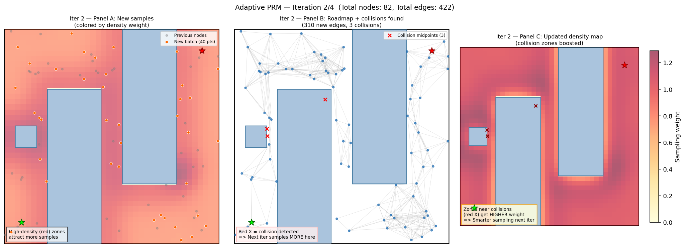

- Graph dày hơn, collision vẫn tập trung ở các góc/biên.
- Density map bắt đầu tạo **hotspot** rõ rệt.

---

### A4 — Iteration 3/4 (bắt đầu có best path)

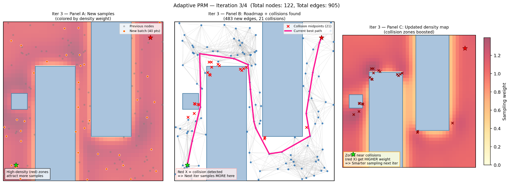

- Đường **hồng** = current best path (đã tìm được đường).
- Collision midpoints tăng -> update density mạnh hơn quanh vùng khó.

---

### A5 — Iteration 4/4

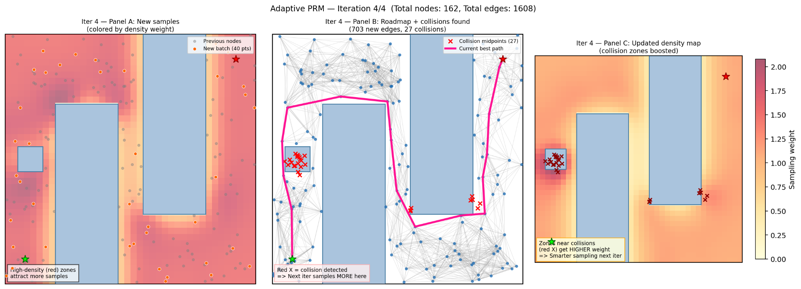

- Roadmap rất dày, best path ổn định hơn.
- Density map tập trung mạnh quanh các “điểm gắt” (corner / passage).

---

### A_final — Density evolution (Iter 0 -> 4)

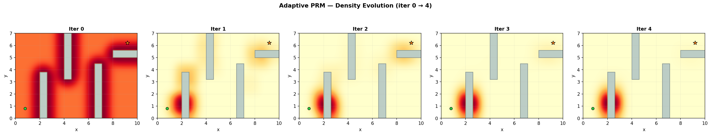

- Thấy rõ density map “học” dần nơi hard zones nằm.

---

### A_compare — Final roadmap vs nơi thuật toán tập trung sampling

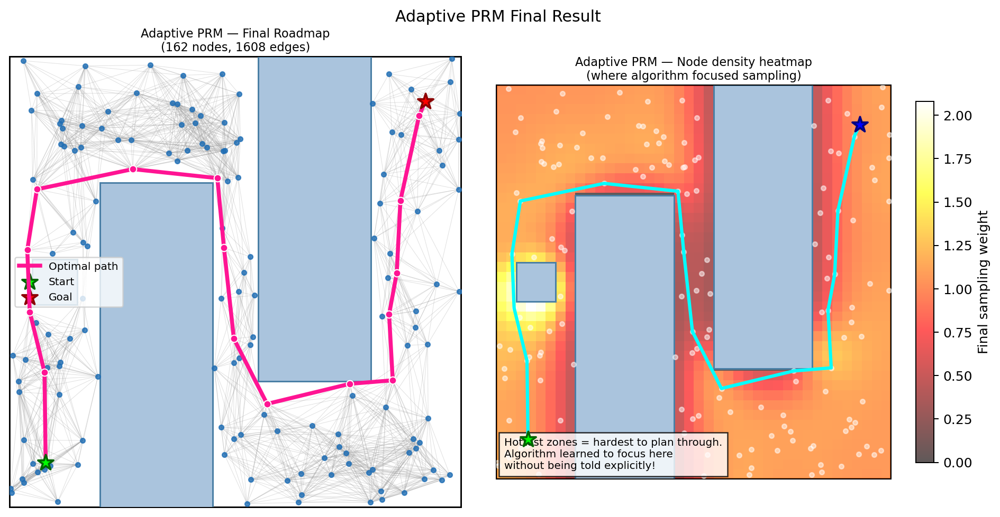

- Trái: roadmap cuối + đường (hồng).
- Phải: heatmap cho thấy nơi thuật toán “đổ công” sampling (hard zones).

---

## 🔵 Lazy PRM\* — “Combo thực dụng”

### L1 — Step 1: Sample nodes + minh hoạ radius PRM\*

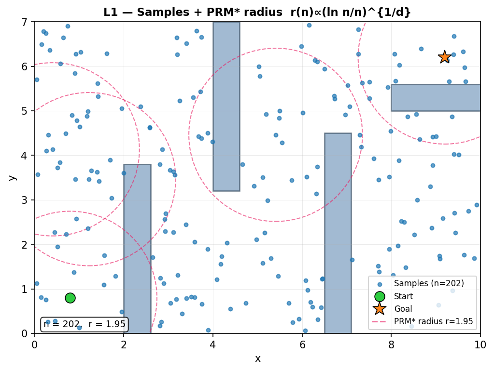

- PRM\* dùng radius thích nghi $r(n) \propto (\ln n / n)^{1/d}$ -> $n$ tăng thì radius giảm.
- Mục tiêu: đảm bảo liên thông khi n nhỏ, và tiệm cận tối ưu khi n lớn.

---

### L2 — Step 2: Build ALL radius edges (SKIP collision check)

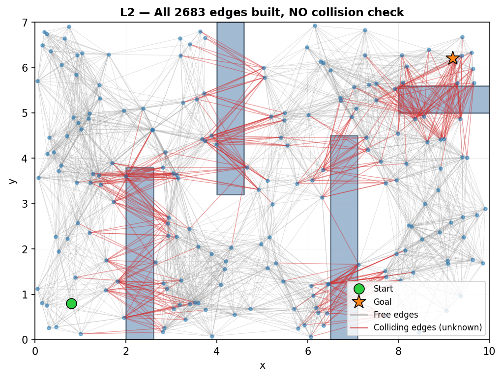

- Tạo **toàn bộ edges** trước, **chưa collision-check**.
- Các cạnh đỏ là cạnh xuyên obstacle (chưa bị loại) -> tiết kiệm preprocessing.

---

### L3 — Step 3: Iteration 1 (Dijkstra -> validate only path edges)

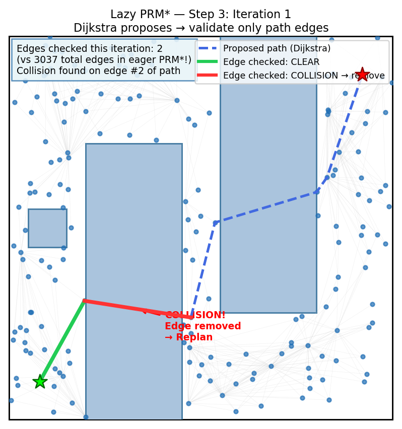

- Dijkstra đề xuất path (xanh đứt), chỉ check cạnh trên path.
- Gặp collision -> remove edge -> replan.

---

### L4 — All iterations: replan sau mỗi collision discovery

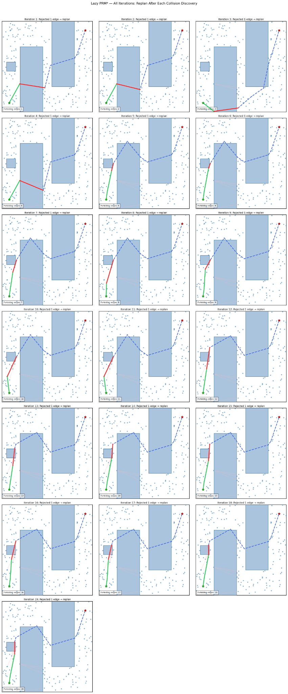

- Mỗi ô: path mới + cạnh bị reject + forbidden edges tích luỹ.

---

### L5 — Final result (tối ưu, collision-free)

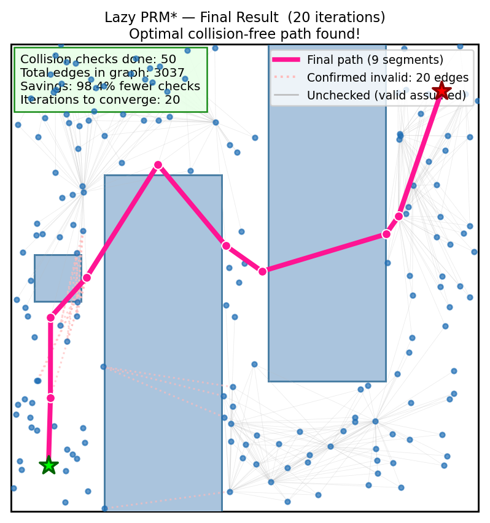

- Chỉ **50 collision checks** trên tổng **3037 edges** -> tiết kiệm ~98%.

---

### L6 — Efficiency charts (Eager vs Lazy PRM\*)

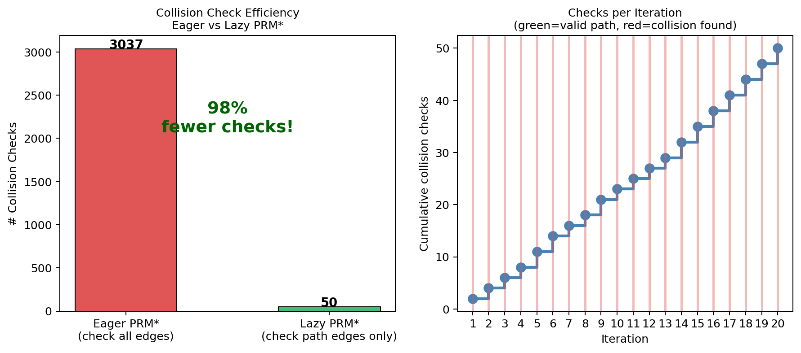

- Bar chart: Eager check-all vs Lazy check-on-path.
- Đồ thị bậc thang: mỗi iteration chỉ tăng ít check.

---
