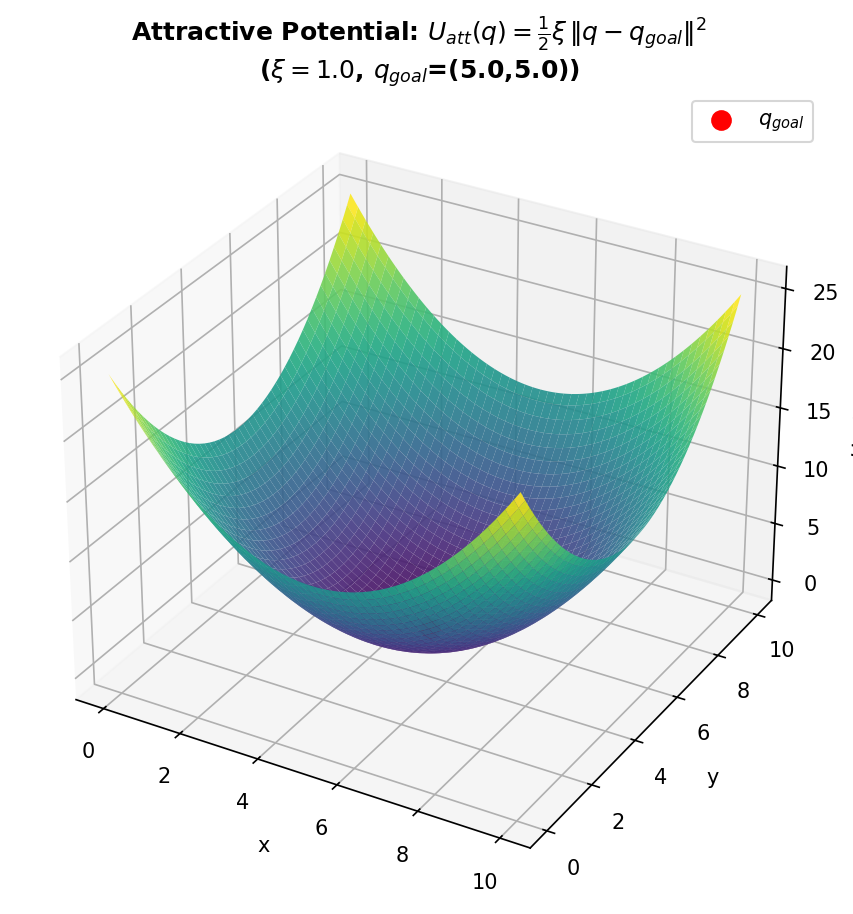
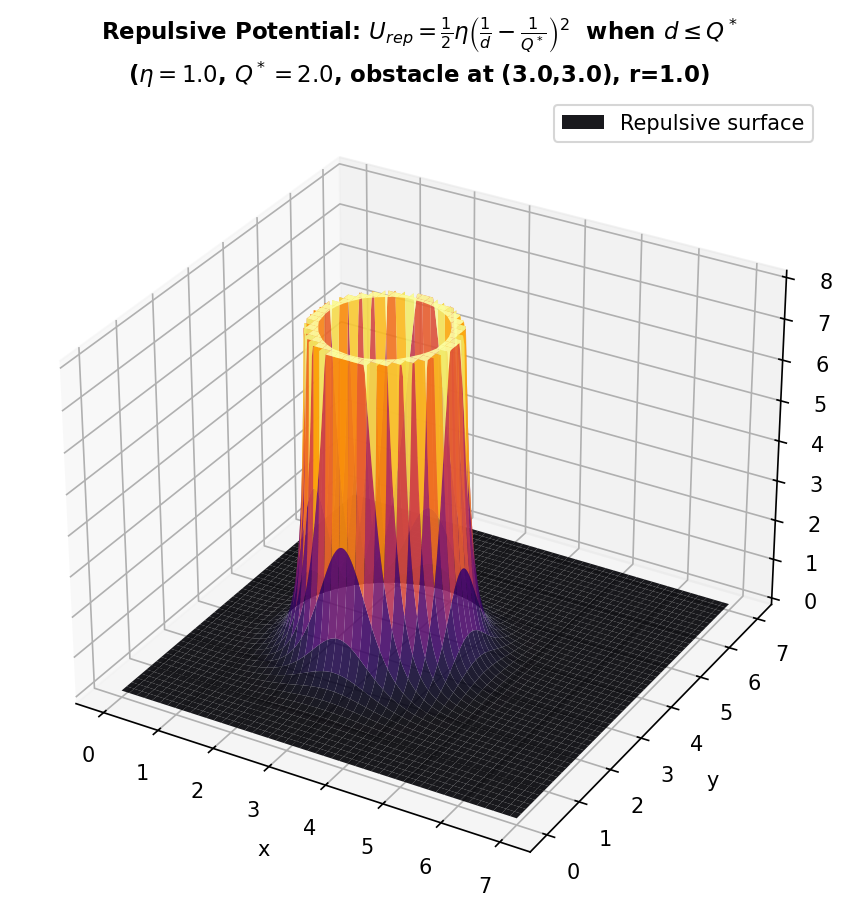
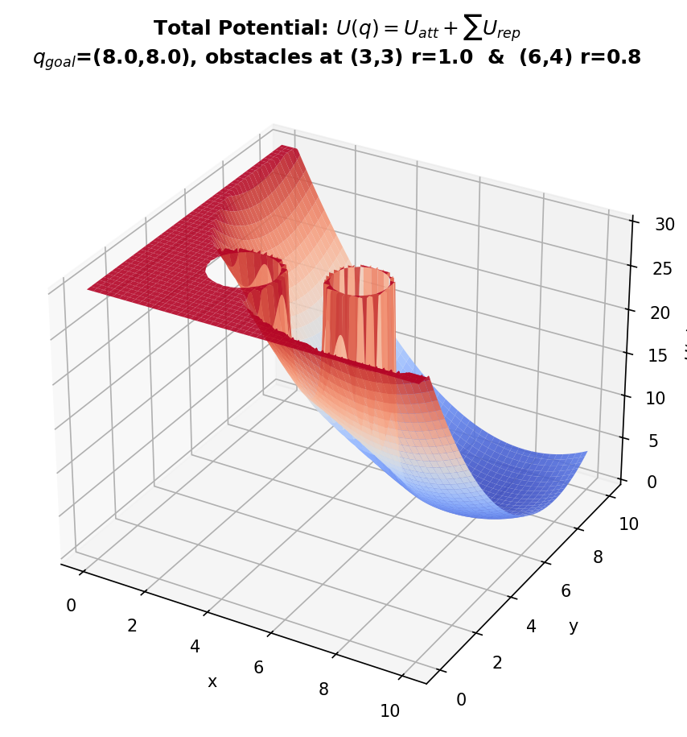
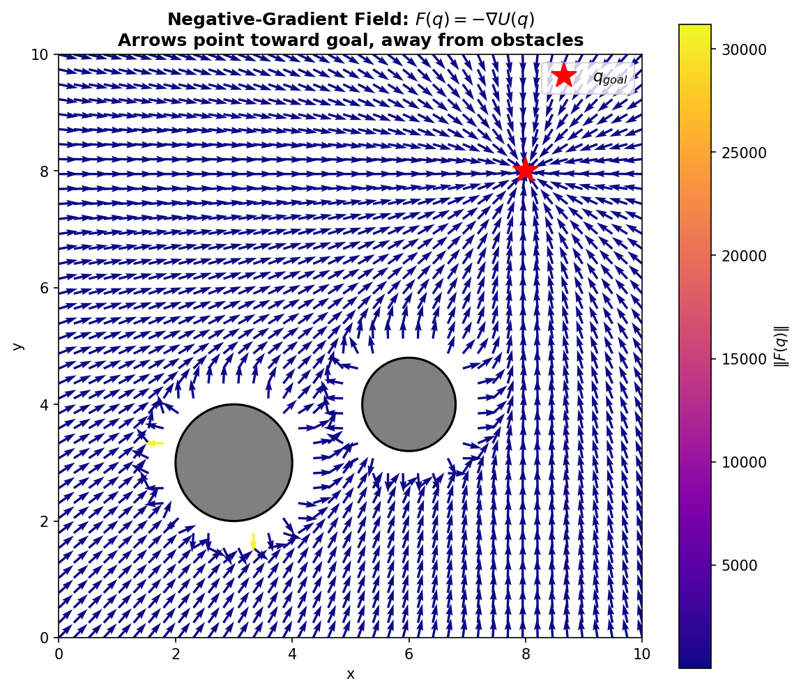
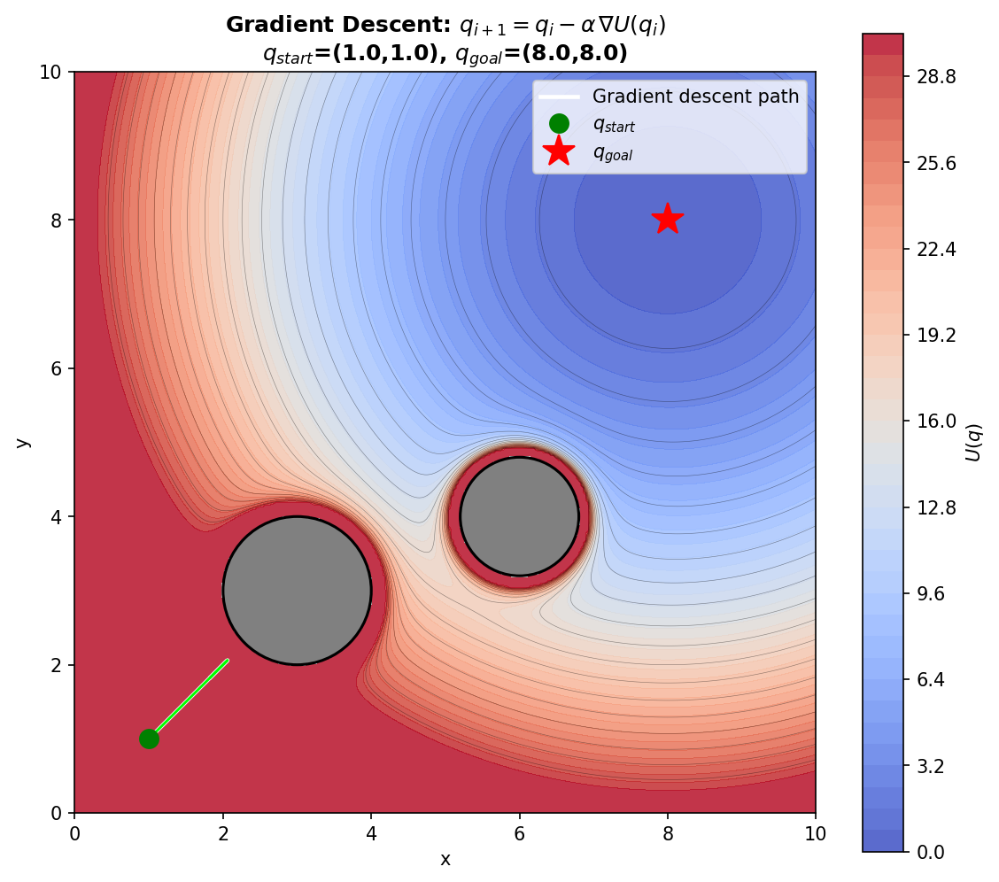
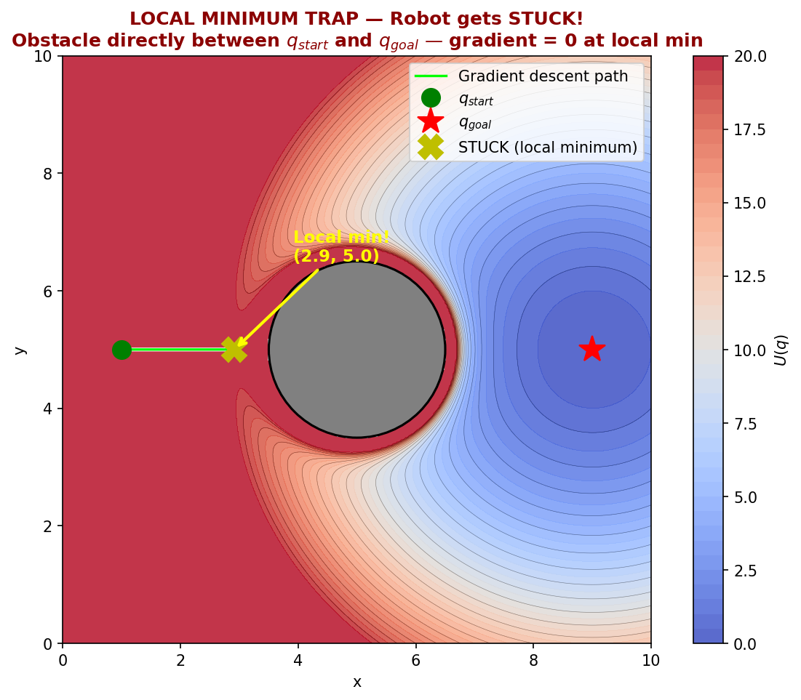
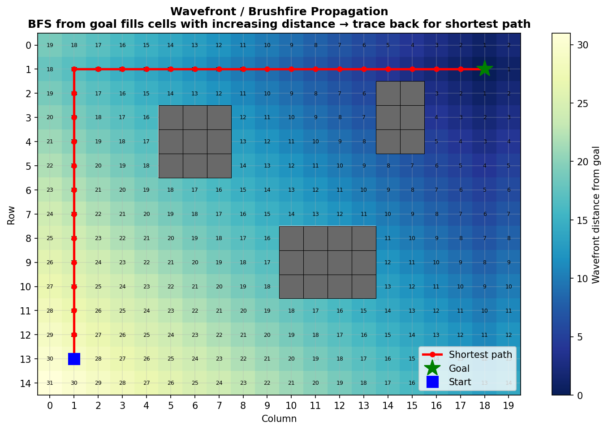

# Potential Field Method — Gradient Descent Path Planning + Pros/Cons

Gói này minh hoạ đề bài:

> **Question 7: Explain the potential field method and its pros and cons**

Bằng phương pháp **Artificial Potential Field (APF)** kết hợp **Gradient Descent** để lập kế hoạch đường đi cho robot, kèm phân tích ưu/nhược điểm và giải pháp thay thế (wavefront/brushfire).

---

## Core idea: Robot "lăn xuống dốc" trong trường thế nhân tạo

Ý tưởng chính: xây dựng một hàm thế $U(q)$ trên toàn bộ configuration space sao cho:

- **Goal** nằm ở **đáy** (minimum) của $U$ → robot bị "hút" về goal.
- **Obstacles** tạo **đỉnh cao** (barrier) → robot bị "đẩy" ra xa vật cản.
- Robot di chuyển bằng cách **đi ngược gradient** (gradient descent): luôn bước về hướng $U$ giảm nhanh nhất.

---

## Nền tảng toán học

### 1. Attractive Potential (thế hút)

$$
U_{att}(q) = \frac{1}{2} \xi \, \|q - q_{goal}\|^2
$$

Với $\xi > 0$ là hệ số hút. Đây là hàm bậc 2 (paraboloid) có minimum tại $q_{goal}$.

Gradient:

$$
\nabla U_{att}(q) = \xi \, (q - q_{goal})
$$

### 2. Repulsive Potential (thế đẩy)

Cho mỗi vật cản, với $d(q)$ là khoảng cách từ $q$ đến biên vật cản:

$$
U_{rep}(q) = \begin{cases} \frac{1}{2} \eta \left(\frac{1}{d(q)} - \frac{1}{Q^{\ast}}\right)^2 & \text{if } d(q) \leq Q^{\ast} \\ 0 & \text{if } d(q) > Q^{\ast} \end{cases}
$$

Với $\eta > 0$ là hệ số đẩy, $Q^{\ast}$ là ngưỡng ảnh hưởng (influence distance).

### 3. Total Potential

$$
U(q) = U_{att}(q) + \sum_{i} U_{rep,i}(q)
$$

### 4. Gradient Descent

Robot cập nhật vị trí:

$$
q_{i+1} = q_i - \alpha \, \nabla U(q_i)
$$

Với $\alpha > 0$ là step size. Lực tổng hợp:

$$
F(q) = -\nabla U(q) = F_{att}(q) + F_{rep}(q)
$$

---

## Mô tả từng ảnh

### Image 1 — Attractive Potential (3D bowl)
**File:** `img1_attractive_potential.png`

Bề mặt 3D của $U_{att}(q) = \frac{1}{2}\xi\|q-q_{goal}\|^2$ với $q_{goal}=(5,5)$.
Hình dạng **paraboloid (bát)** — minimum tại goal, tăng dần khi xa goal.
→ Robot luôn bị "hút" về đáy bát (goal).

---

### Image 2 — Repulsive Potential (quanh 1 vật cản)
**File:** `img2_repulsive_potential.png`

Bề mặt 3D của $U_{rep}$ quanh vật cản tròn tại $(3,3)$, bán kính $r=1.0$.
- Gần biên vật cản: $U_{rep}$ tăng vọt (vô cực khi $d \to 0$).
- Ngoài vùng ảnh hưởng $Q^{\ast}=2.0$: $U_{rep}=0$.
→ Tạo "bức tường vô hình" đẩy robot ra xa.

---

### Image 3 — Total Potential Surface (2 vật cản)
**File:** `img3_total_potential_surface.png`

$U(q) = U_{att} + \sum U_{rep}$ với $q_{goal}=(8,8)$ và 2 vật cản tại $(3,3)$ r=1.0, $(6,4)$ r=0.8.
- Đáy lõm tại goal (hút).
- Đỉnh nhọn tại mỗi vật cản (đẩy).
→ Robot "lăn" trên bề mặt này từ bất kỳ đâu về goal.

---

### Image 4 — Gradient (Force) Field
**File:** `img4_gradient_field.png`

Trường vector $F(q) = -\nabla U(q)$:
- Mũi tên chỉ hướng lực tổng hợp tác dụng lên robot.
- Xa vật cản: mũi tên hướng về goal (lực hút chiếm ưu thế).
- Gần vật cản: mũi tên đẩy ra xa (lực đẩy chiếm ưu thế).
→ Robot chỉ cần đi theo mũi tên tại vị trí hiện tại.

---

### Image 5 — Gradient Descent Path
**File:** `img5_gradient_descent_path.png`

Đường đi từ $q_{start}=(1,1)$ đến $q_{goal}=(8,8)$ bằng gradient descent trên contour map.
- Đường xanh lá cây: quỹ đạo robot.
- Robot tự động vòng tránh 2 vật cản.
→ Minh hoạ gradient descent hoạt động tốt khi không có local minimum.

---

### Image 6 — Local Minimum Trap (BẪY CỰC TIỂU ĐỊA PHƯƠNG)
**File:** `img6_local_minimum_trap.png`

**Đây là nhược điểm CHÍNH của potential field!**

Setup: $q_{start}=(1,5)$, $q_{goal}=(9,5)$, vật cản **ngay giữa** tại $(5,5)$ r=1.5.
- Lực hút (về phải) và lực đẩy (về trái) **triệt tiêu nhau** → $\nabla U = 0$.
- Robot bị **kẹt** tại local minimum, **không bao giờ đến goal**.
→ Gradient descent **không đảm bảo tìm được đường** (not complete).

---

### Image 7 — Wavefront / Brushfire (giải pháp thay thế)
**File:** `img7_wavefront_brushfire.png`

Giải pháp cho vấn đề local minimum: dùng **wavefront/brushfire** trên lưới rời rạc.
- BFS từ goal: mỗi ô ghi khoảng cách (số bước) đến goal.
- Truy ngược từ start → goal theo ô giảm dần → **luôn tìm được đường ngắn nhất**.
→ **Complete** (nếu đường tồn tại, luôn tìm được) — khác với potential field.

---

## Ưu điểm (Pros)

| Ưu điểm | Giải thích |
|----------|-----------|
| **Đơn giản** | Chỉ cần tính gradient tại vị trí hiện tại, không cần search toàn bộ không gian |
| **Tính toán nhanh** | $O(1)$ mỗi bước (tính lực tại 1 điểm), phù hợp real-time |
| **Reactive** | Phản ứng tức thì với vật cản mới xuất hiện (chỉ cần cập nhật $U_{rep}$) |
| **Smooth path** | Đường đi trơn tru, không bị gấp khúc |
| **Dễ mở rộng** | Thêm vật cản = thêm số hạng $U_{rep}$, không thay đổi thuật toán |

## Nhược điểm (Cons)

| Nhược điểm | Giải thích |
|------------|-----------|
| **Local minima** | Robot bị kẹt tại cực tiểu địa phương khi $\nabla U = 0$ nhưng không phải goal (Image 6) |
| **Not complete** | Không đảm bảo tìm được đường dù đường tồn tại |
| **Oscillation** | Robot có thể dao động qua lại trong hành lang hẹp giữa 2 vật cản |
| **No passage** | Giữa 2 vật cản gần nhau, lực đẩy quá mạnh → robot không đi qua được dù có đủ chỗ |
| **Goal unreachable** | Nếu goal gần vật cản, $U_{rep}$ có thể lớn hơn $U_{att}$ tại goal → goal không phải minimum |

## Giải pháp cho local minima

- **Navigation Function**: thiết kế $U(q)$ đặc biệt sao cho chỉ có **đúng 1 minimum** (tại goal).
- **Randomized escape**: khi phát hiện kẹt, thêm nhiễu ngẫu nhiên.
- **Wavefront/Brushfire** (Image 7): dùng BFS trên lưới → complete, luôn tìm đường nếu tồn tại.
- **Kết hợp PRM/RRT**: dùng potential field làm local planner, sampling-based làm global planner.

---

## Nội dung trong thư mục

- `generate_potential_field_demo.py` — script tạo tất cả 7 ảnh
- `README.md` (file này)
- `img1_attractive_potential.png`
- `img2_repulsive_potential.png`
- `img3_total_potential_surface.png`
- `img4_gradient_field.png`
- `img5_gradient_descent_path.png`
- `img6_local_minimum_trap.png`
- `img7_wavefront_brushfire.png`
