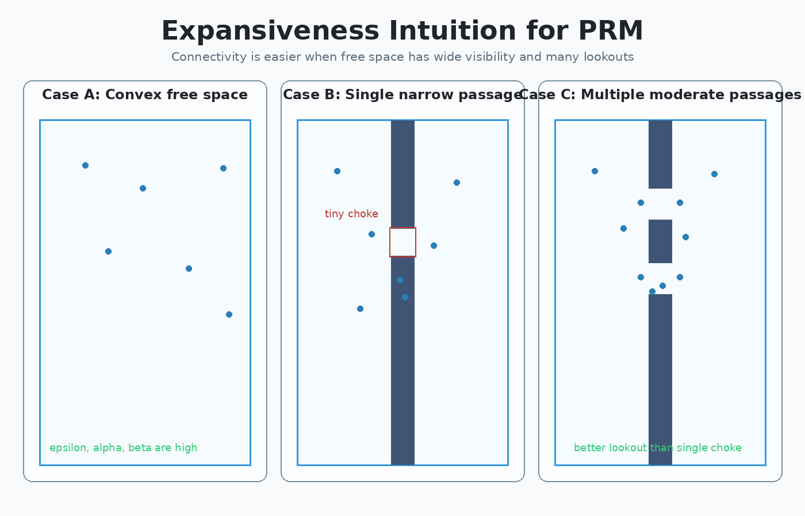
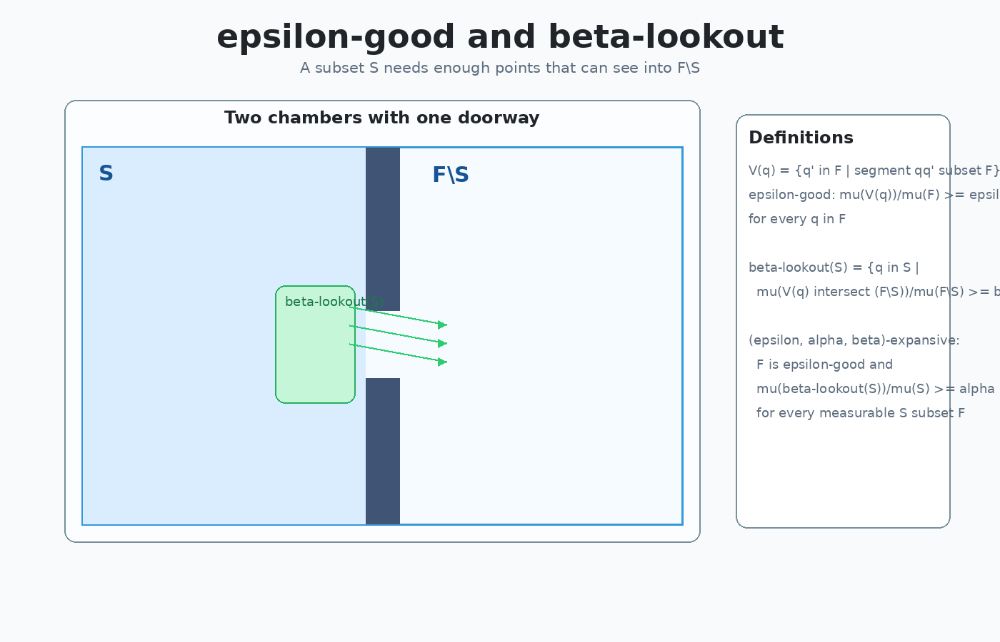
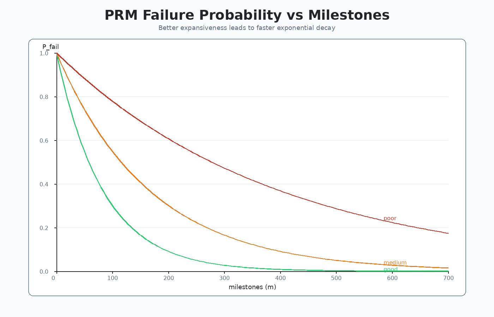
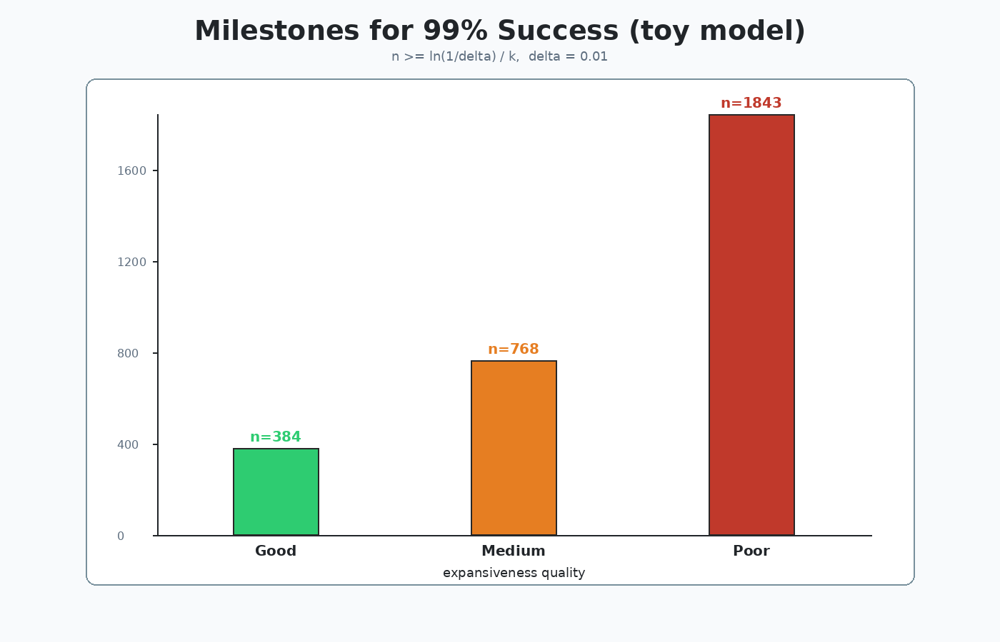
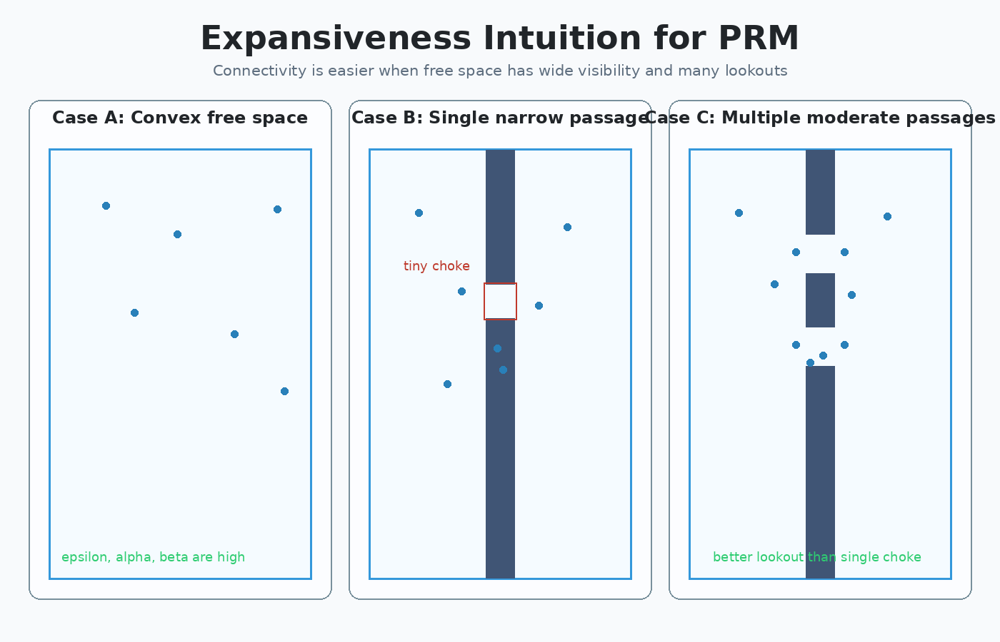

# Explain the concept of expansiveness (Question 16) -- PRM-oriented package

This package answers:

> **Question 16: explain the concept of expansiveness and discuss pros/cons.**

It is aligned with the PRM lecture discussion of **(epsilon, alpha, beta)-expansive free spaces** and why roadmap connectivity/coverage becomes easier in expansive spaces.

---

## Core definitions

Let $F$ be free space, and let $\mu(\cdot)$ denote volume (measure).

### 1. Visibility set of a configuration

$$
V(q) = \lbrace q' \in F \mid \overline{qq'} \subset F \rbrace
$$

So $V(q)$ is the set of free configurations directly visible from $q$.

### 2. Epsilon-good free space

$$
\frac{\mu(V(q))}{\mu(F)} \ge \epsilon, \quad \forall q \in F
$$

Interpretation: every point can "see" at least an $\epsilon$ fraction of free space.

### 3. Beta-lookout of a subset $S \subset F$

$$
\beta\text{-lookout}(S)
= \left\lbrace q \in S \mid
\frac{\mu\big(V(q) \cap (F \setminus S)\big)}{\mu(F \setminus S)} \ge \beta
\right\rbrace
$$

Interpretation: points in $S$ that can see a significant fraction of the outside region $F \setminus S$.

### 4. (epsilon, alpha, beta)-expansive

$F$ is $(\epsilon,\alpha,\beta)$-expansive if:

- $F$ is epsilon-good, and
- for every measurable $S \subset F$:

$$
\frac{\mu(\beta\text{-lookout}(S))}{\mu(S)} \ge \alpha
$$

Interpretation: each subset contains enough "gateway" points (lookouts) that see out.

---

## Why expansiveness matters for PRM

Lecture intuition: in expansive spaces, roadmap quality improves quickly as milestones increase.

- Larger $\epsilon, \alpha, \beta$ -> easier connectivity and coverage.
- Narrow passages reduce these volumetric ratios.
- Then PRM needs more milestones (or smarter sampling) to achieve similar success probability.

A common didactic model for failure probability is exponential decay with milestone count:

$$
P_{\mathrm{fail}}(m) \approx e^{-k m}
$$

where larger $k$ corresponds to better expansiveness.

---

## Pros and cons of the expansiveness concept

### Pros

- Gives geometric intuition for why some C-spaces are easy/hard for PRM.
- Explains PRM probabilistic completeness behavior in expansive settings.
- Motivates practical sampling variants (Gaussian, Bridge, obstacle-based PRM).

### Cons / limitations

- $(\epsilon,\alpha,\beta)$ are very hard to compute in real high-dimensional C-spaces.
- The theory gives trends and guarantees, but not a practical stopping rule by itself.
- Real performance still depends on local planner quality and collision-checking cost.

---

## Visual walkthrough

### Image 1 -- three geometry cases
**File:** `img1_expansiveness_cases.png`



- Case A (convex free space): high expansiveness (best-case intuition).
- Case B (single tiny choke): poor expansiveness; hard connectivity.
- Case C (multiple moderate passages): better lookout structure than one tiny choke.

### Image 2 -- epsilon-good and beta-lookout
**File:** `img2_lookout_definition.png`



Shows a subset $S$ in one chamber and the $\beta$-lookout region near the doorway that can see into $F \setminus S$.

### Image 3 -- failure probability curves
**File:** `img3_failure_probability_curves.png`



Illustrates exponential decrease of PRM failure probability with milestones, faster for better expansiveness.

### Image 4 -- milestones needed for target reliability
**File:** `img4_milestones_vs_expansiveness.png`



Toy model comparison for a fixed target reliability (99% success).
Lower expansiveness needs more milestones.

### GIF summary
**File:** `expansiveness_overview.gif`



---

## Re-generate assets

Requirements:

- Python 3.9+
- `Pillow`

Install and run:

```bash
pip install pillow
python generate_expansiveness_demo.py
```

This regenerates all PNGs and the GIF in this folder.
