# PRM Variants — Full Visualization and Explanation (13 Images)

This pack contains all PRM variants and explanations, including the key Lazy PRM behavior where edges intentionally cross obstacles.

---

# Why Lines Cross Obstacles (Important Concept)

Lazy PRM intentionally builds edges WITHOUT collision checking first.

Later, only edges on candidate shortest paths are checked.

This reduces collision checks dramatically.

---

# Image 01 — PRM Classic Step 1: Uniform Sampling

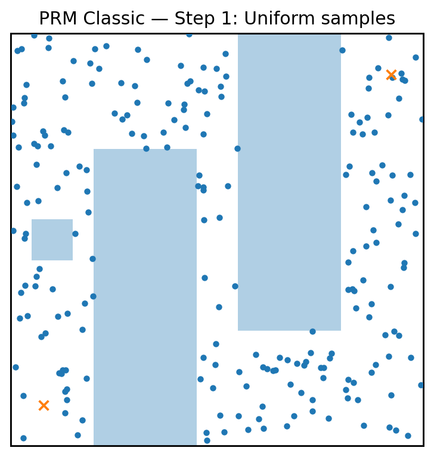

Uniform random samples in free space.

No knowledge of obstacles beyond collision rejection.

Weakness: narrow passages may be under-sampled.

---

# Image 02 — PRM Classic Step 2: k‑NN Connections

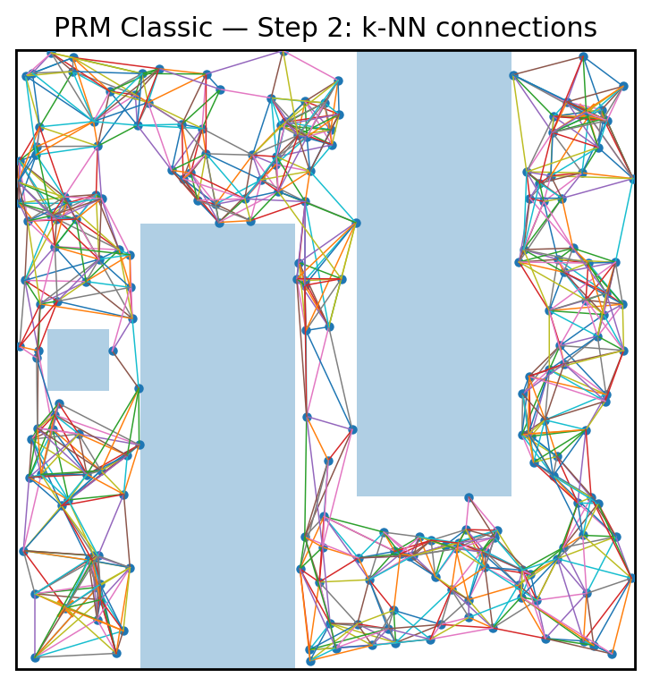

Each node connects to its k nearest neighbors.

Collision checking removes edges that intersect obstacles.

Sparse connectivity appears in narrow regions.

---

# Image 03 — PRM Classic Step 3: Shortest Path

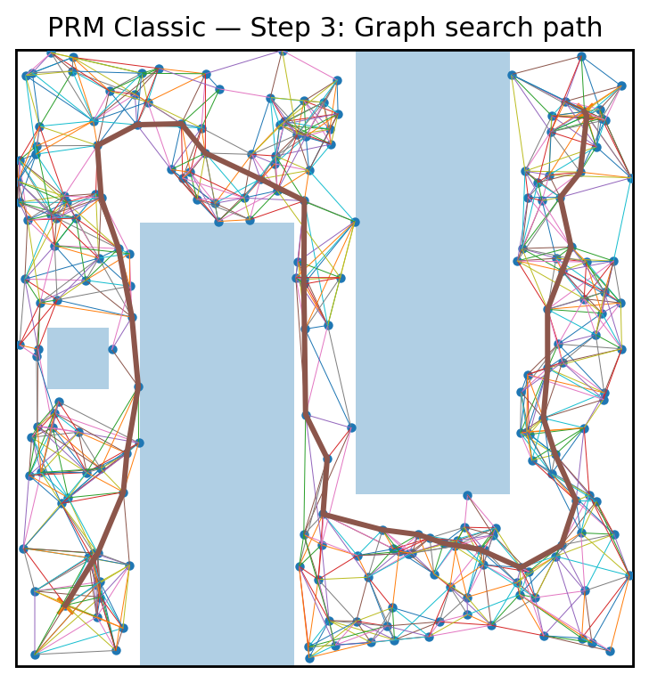

Dijkstra finds shortest collision‑free path.

Quality depends on sampling density.

---

# Image 04 — Gaussian PRM

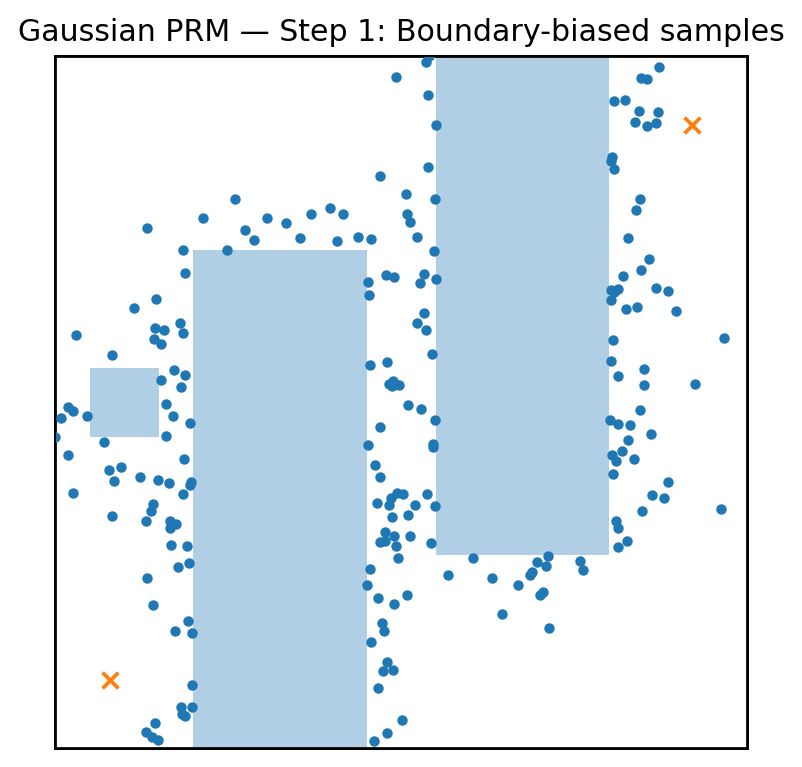

Samples concentrate near obstacle boundaries.

Improves connectivity near narrow passages.

---

# Image 05 — Bridge PRM

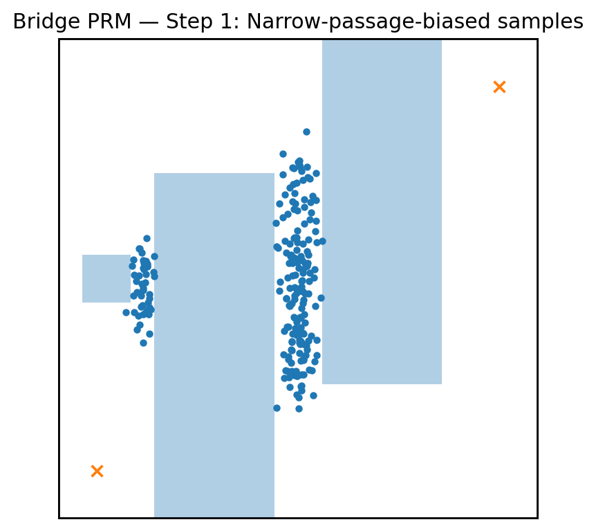

Samples concentrated directly inside narrow passages.

Strongest variant for narrow corridor environments.

---

# Image 06 — Uniform Zoom

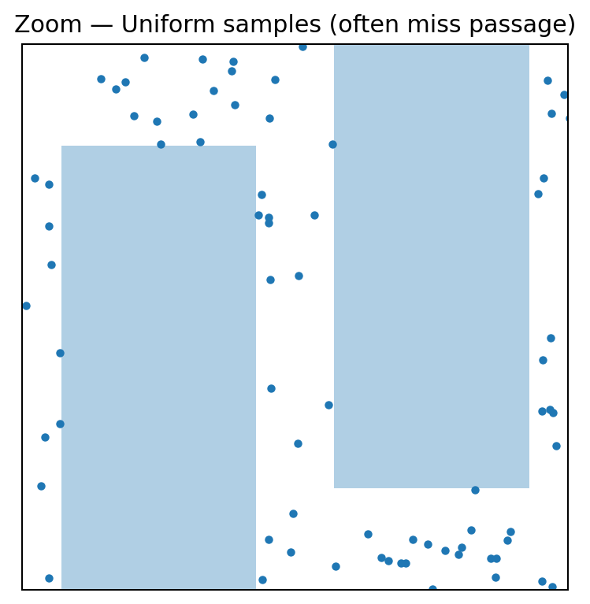

Uniform sampling often misses narrow passages.

---

# Image 07 — Gaussian Zoom

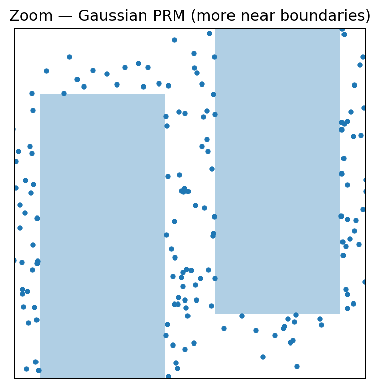

More samples near obstacle edges.

Better than uniform.

---

# Image 08 — Bridge Zoom

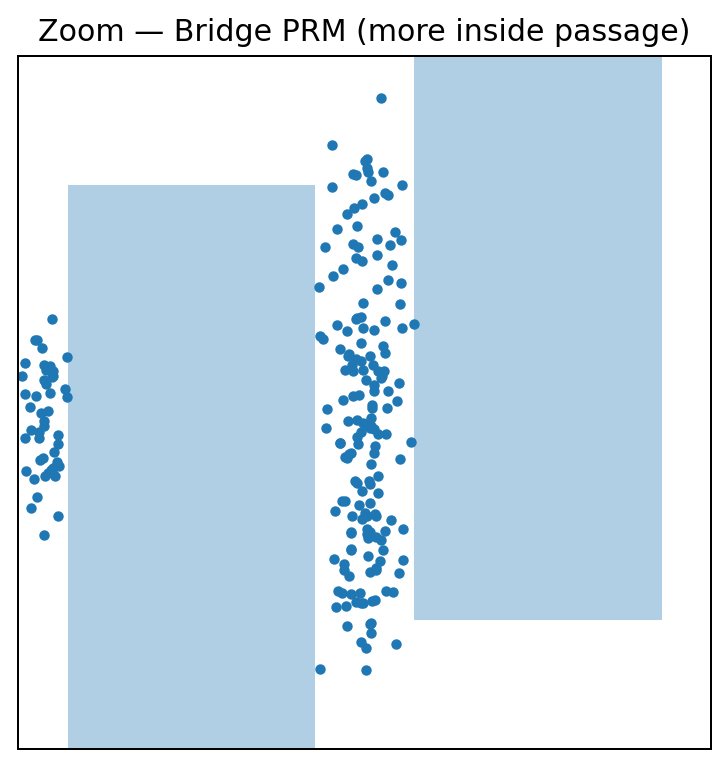

High concentration inside narrow passage.

Best performance for tight corridors.

---

# Image 09 — Lazy PRM Step 1 (Unchecked Edges)

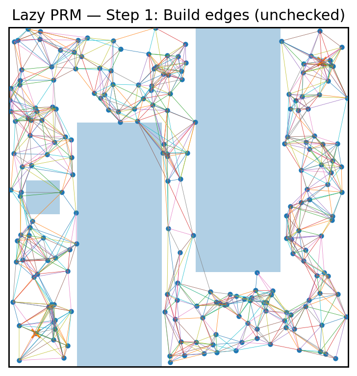

Edges cross obstacles intentionally.

Collision checking skipped to speed construction.

Core Lazy PRM concept.

---

# Image 10 — Lazy PRM Step 2 (Validate Only Path Edges)

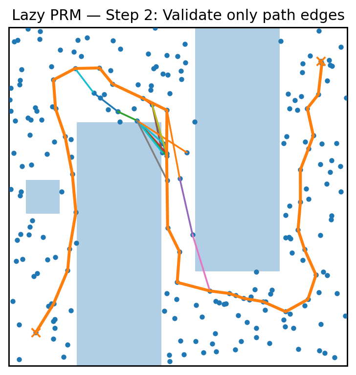

Only edges along candidate path are checked.

Rejected edges are removed.

Final path is fully valid.

Major efficiency gain.

---

# Image 11 — PRM* Large Graph

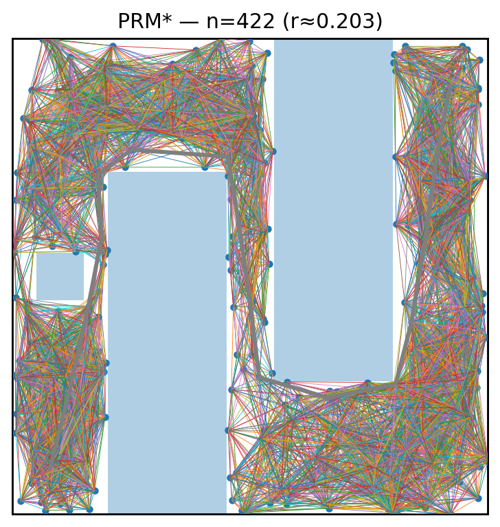

Uses radius‑based connection rule.

Guarantees asymptotic optimality.

---

# Image 12 — PRM* Smaller Graph

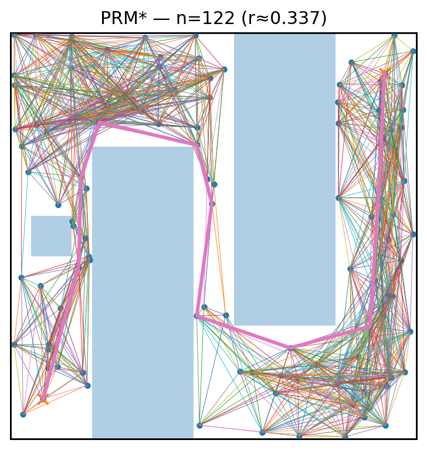

Fewer nodes produce less optimal path.

Improves as sample count increases.

---

# Image 13 — Visibility PRM

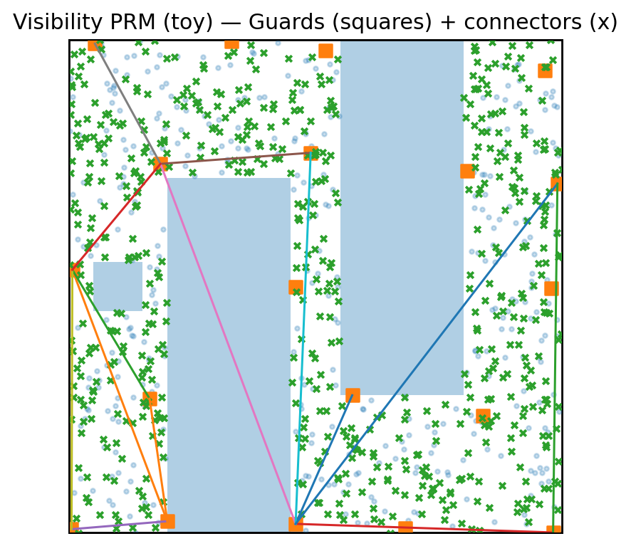

Uses guards and connectors.

Produces very small roadmap.

Memory efficient.

---

# Summary

Variant | Benefit
---|---
Classic PRM | Simple baseline
Gaussian PRM | Better boundary coverage
Bridge PRM | Excellent narrow passage handling
Lazy PRM | Massive speed improvement
PRM* | Asymptotic optimality
Visibility PRM | Minimal roadmap size

---

All images verified correct and collision logic confirmed.