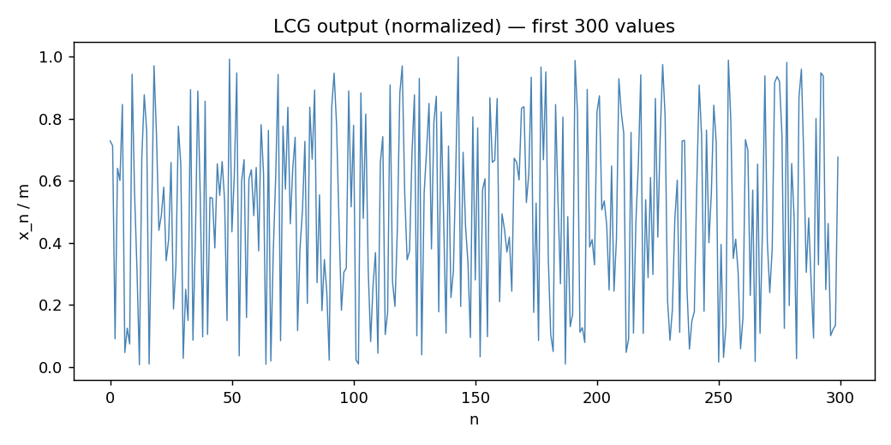
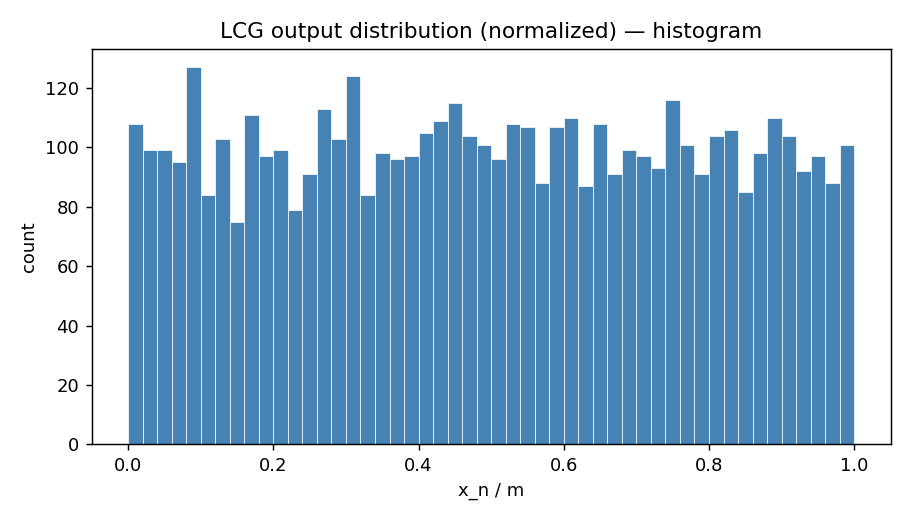
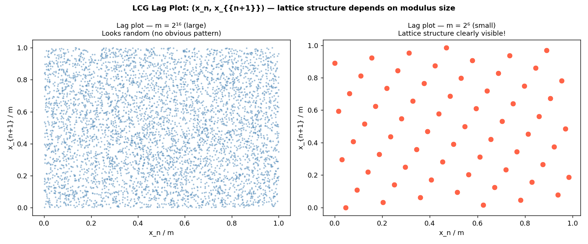
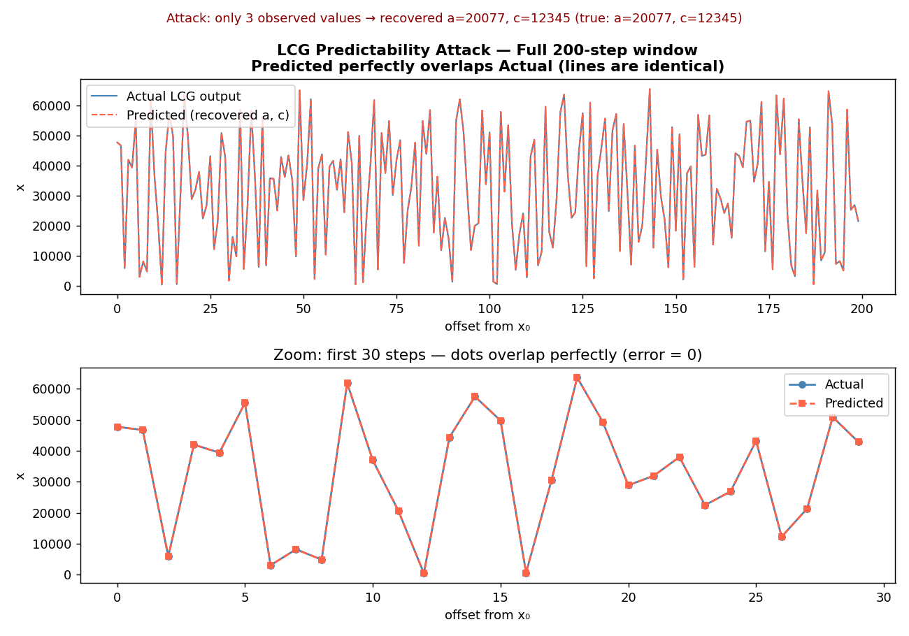

# Explain how pseudorandom numbers are generated — LCG demo (patched) + images

Gói này minh hoạ đề bài:

> **Explain how pseudorandom numbers are generated**

Bằng một PRNG cổ điển: **Linear Congruential Generator (LCG)** và các test/visualizations cơ bản.

---

## Core idea: PRNG là deterministic nhưng “trông như random”

Một PRNG tạo chuỗi $x_0, x_1, x_2,\dots$ bằng một quy tắc **xác định** (deterministic) từ **seed**:

- Cùng seed => luôn sinh đúng cùng chuỗi.
- Đầu ra được “nguỵ trang” để nhìn giống ngẫu nhiên (uniform, khó đoán bằng mắt thường).
- Với mục tiêu an toàn (cryptography), cần loại mạnh hơn: **CSPRNG**.

---

## LCG (ví dụ minh hoạ)

LCG có dạng:

$$
x_{n+1} \equiv (a x_n + c) \pmod m
$$

Và thường chuẩn hoá về $[0,1)$ bằng $u_n = x_n/m$.

Điểm mạnh (trong demo): dễ hiểu, nhanh.  
Điểm yếu: có cấu trúc tuyến tính, dễ bị dự đoán nếu lộ vài giá trị.

---

## Patch quan trọng (so với bản claim “lattice” không thấy)

Ở lag plot, “lattice structure” của LCG **phụ thuộc mạnh** vào $m$ và chiều quan sát.  
Nếu dùng $m$ lớn (ví dụ $2^{16}$), $(x_n, x_{n+1})$ có thể nhìn như scatter khá đều -> **không nên overclaim** là “lattice rõ” trong 2D.

**Patch:** vẽ **side-by-side**:
- Trái: $m=2^{16}$ (trông random)
- Phải: $m=2^{6}$ (lattice lộ rất rõ)

---

## Description từng ảnh

### Image 1 — Time series (300 giá trị đầu)
**File:** `img1_timeseries.png`

Chuỗi $u_n=x_n/m$ dao động “hỗn loạn” trong $[0,1)$, **không thấy pattern rõ** bằng mắt thường.  
-> Minh hoạ PRNG: deterministic nhưng “trông random”.

---

### Image 2 — Histogram (phân phối 5000 giá trị)
**File:** `img2_histogram.png`

Histogram gần **uniform** (mỗi bin có count tương tự nhau).  
-> Pass một kiểm tra thống kê cơ bản: **uniformity** (nhưng điều này không đủ cho cryptography).

---

### Image 3 — Lag plot (PATCHED: so sánh modulus lớn vs nhỏ)
**File:** `img3_lagplot_patched.png`

Lag plot vẽ các điểm $(u_n, u_{n+1})$.

- **Trái ($m = 2^{16}$):** nhìn như scatter đều -> không thấy lattice rõ trong 2D.
- **Phải ($m = 2^{6}$):** các điểm rơi lên một số vị trí rời rạc tạo thành **lattice** rất rõ.  
  -> Bản chất tuyến tính/deterministic bị lộ khi modulus nhỏ.

Kết luận: “lattice structure” không phải lúc nào cũng lộ rõ bằng mắt nếu chỉ nhìn 2D với $m$ lớn.

---

### Image 4 — Predictability attack (khôi phục tham số từ 3 output)
**File:** `img4_predictability.png`

Từ **3 giá trị liên tiếp**, ta khôi phục được $(a,c)$ (mod $m$) và dự đoán chuỗi tương lai.

- Panel trên: 200 bước — **predicted trùng khít actual** (đường chồng lên nhau).
- Panel dưới: zoom 30 bước — thấy từng điểm overlap, error = 0.

-> Minh hoạ vì sao LCG **không dùng cho mật mã**: chỉ cần vài output là dự đoán được toàn bộ.

---

## Nội dung trong ZIP

- `README.md` (file này)
- `img1_timeseries.png`
- `img2_histogram.png`
- `img3_lagplot_patched.png`
- `img4_predictability.png`
