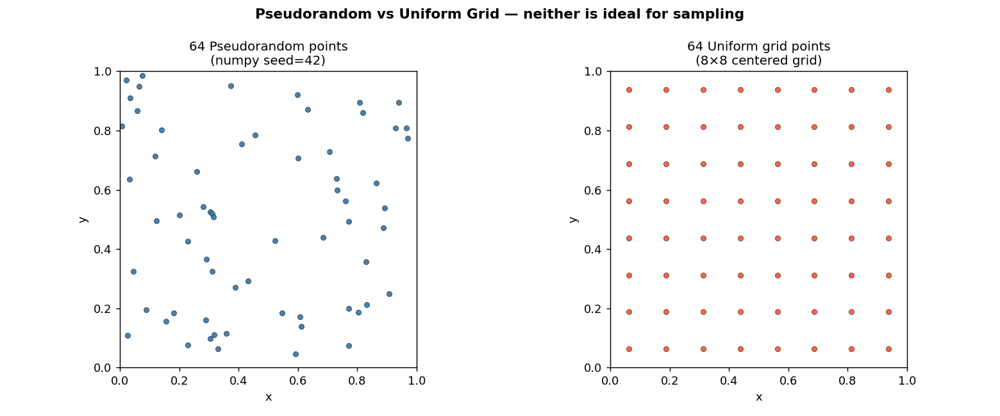
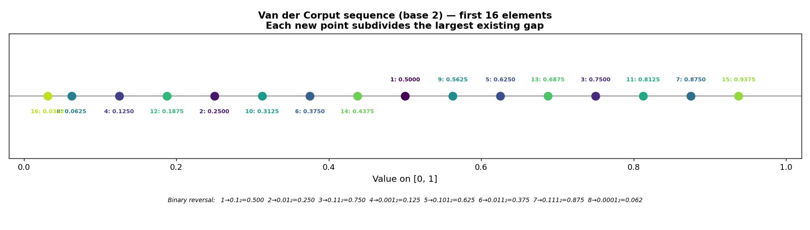
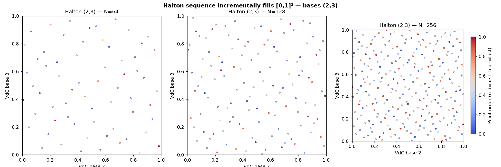
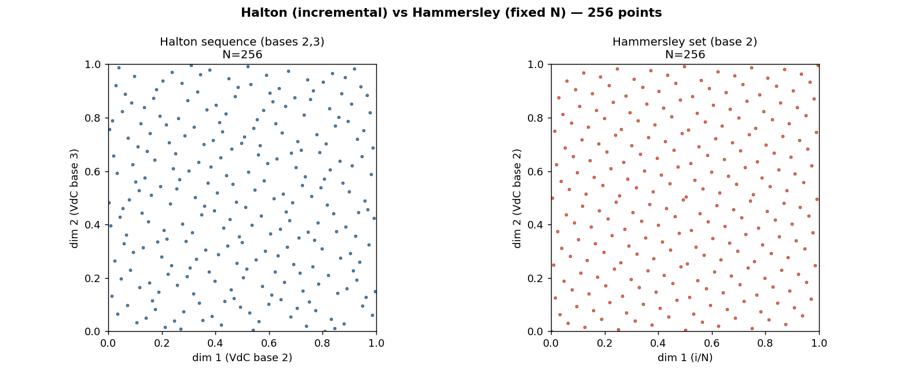
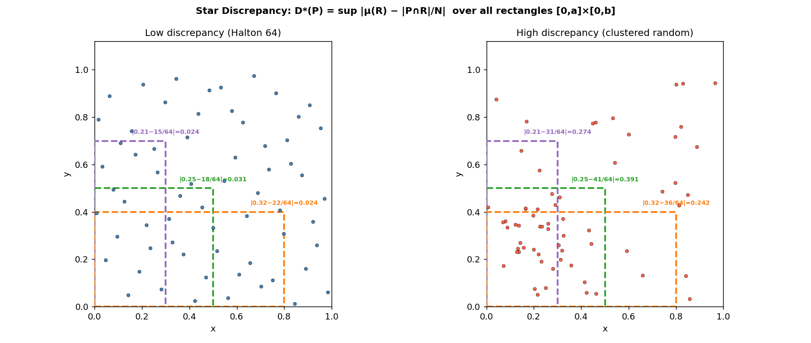
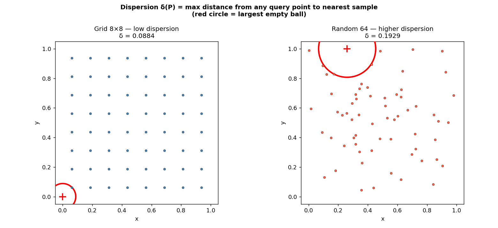
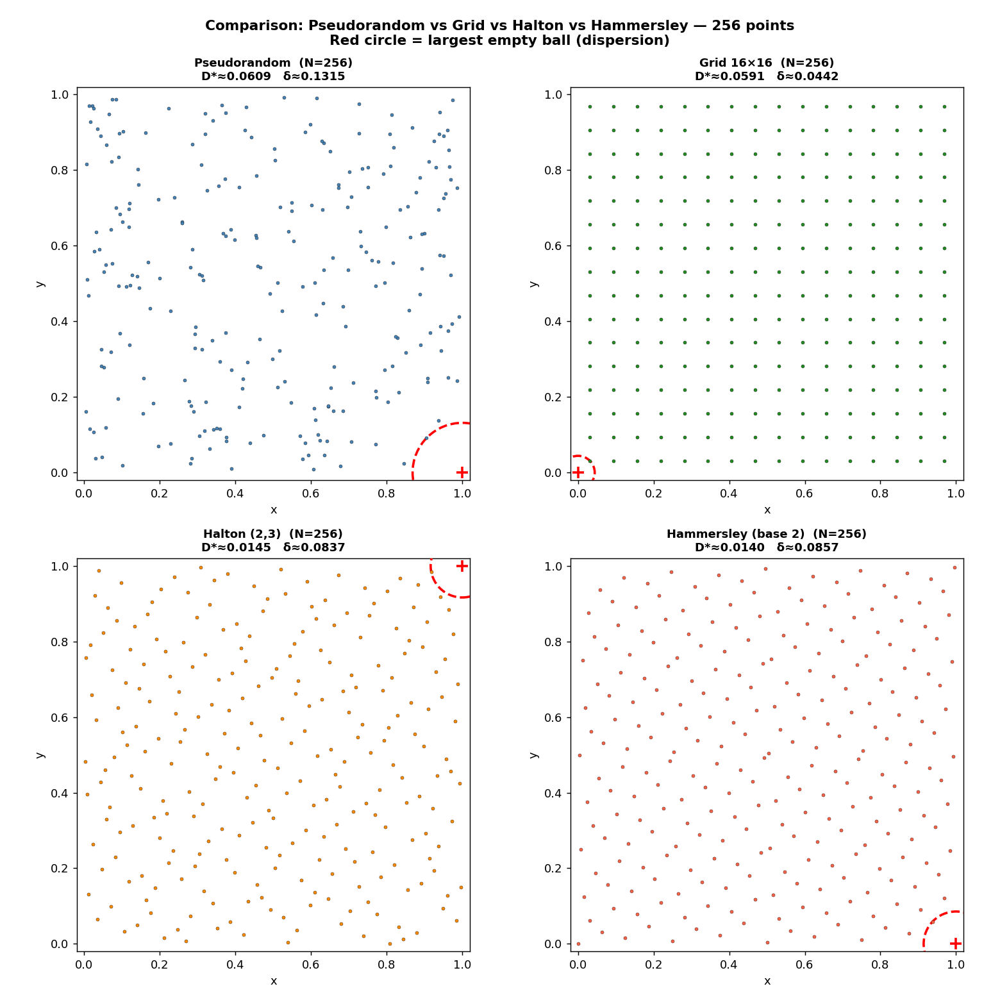

# Explain metrics in quasirandom sampling — Halton, Hammersley, Discrepancy & Dispersion

Gói này minh hoạ đề bài:

> **Question 15: Explain metrics in quasirandom sampling**

Bằng các chuỗi quasirandom kinh điển: **Halton**, **Hammersley**, và hai metric quan trọng: **discrepancy** và **dispersion**.

---

## Vấn đề: tại sao không dùng pure random sampling?

Pseudorandom sampling (ví dụ dùng LCG, Mersenne Twister) có thể sinh ra các **cluster** và **gap** — dẫn tới coverage không đều trong không gian. Grid sampling thì đều nhưng **không incremental** (phải biết trước $N$) và bị **curse of dimensionality**.

**Quasirandom sequences** (còn gọi là low-discrepancy sequences) khắc phục bằng cách:
- Lấp đầy không gian **đồng đều hơn** pseudorandom
- **Incremental**: có thể thêm điểm mà không cần biết trước $N$ (Halton)
- Có **bound lý thuyết** cho discrepancy: $D^* = O((\log N)^d / N)$

---

## Chuỗi Van der Corput

Nền tảng của Halton và Hammersley. Với base $b$, phần tử thứ $n$ được tính bằng cách **đảo ngược các chữ số** của $n$ trong hệ cơ số $b$:

$$
\phi_b(n) = \sum_{k=0}^{L} d_k \cdot b^{-(k+1)}
$$

trong đó $n = d_0 + d_1 b + d_2 b^2 + \cdots + d_L b^L$ là biểu diễn của $n$ trong hệ cơ số $b$.

Ví dụ base 2:
- $1 = 1_2 \Rightarrow \phi_2(1) = 0.1_2 = 0.5$
- $2 = 10_2 \Rightarrow \phi_2(2) = 0.01_2 = 0.25$
- $3 = 11_2 \Rightarrow \phi_2(3) = 0.11_2 = 0.75$

Mỗi điểm mới **chia đôi khoảng trống lớn nhất** — đây là tính chất quan trọng nhất.

---

## Halton sequence

Chuỗi Halton $d$-chiều sử dụng Van der Corput với các **base nguyên tố khác nhau** cho mỗi chiều:

$$
\mathbf{x}_n = \big(\phi_{p_1}(n),\; \phi_{p_2}(n),\; \dots,\; \phi_{p_d}(n)\big)
$$

với $p_1 < p_2 < \cdots < p_d$ là các số nguyên tố (thường $p_1=2, p_2=3, p_3=5, \dots$).

**Ưu điểm:** incremental — có thể thêm điểm mà không cần biết trước $N$.
**Nhược điểm:** ở chiều cao, các base nguyên tố lớn gây ra correlation pattern.

---

## Hammersley set

Hammersley cố định chiều đầu tiên thành $i/N$ (đều trên lưới), các chiều còn lại dùng Van der Corput:

$$
\mathbf{x}_i = \big(i/N,\; \phi_{p_1}(i),\; \phi_{p_2}(i),\; \dots,\; \phi_{p_{d-1}}(i)\big)
$$

**Ưu điểm:** discrepancy thấp hơn Halton với cùng $N$ vì chiều đầu tiên hoàn toàn đều.
**Nhược điểm:** phải biết trước $N$ — **không incremental**.

---

## Metric 1: Star Discrepancy $D^*$

Star discrepancy đo mức **không đều** của tập điểm $P = \{p_1, \dots, p_N\}$ so với phân phối đều. Xét tất cả các hình chữ nhật $R = [0,a_1] \times [0,a_2] \times \cdots \times [0,a_d]$ neo tại gốc:

$$
D^*(P) = \sup_{R \in \mathcal{R}^*} \left| \mu(R) - \frac{|P \cap R|}{N} \right|
$$

trong đó:
- $\mu(R) = a_1 \cdot a_2 \cdots a_d$ là thể tích (xác suất lý thuyết)
- $|P \cap R|/N$ là tỷ lệ điểm thực tế rơi trong $R$

**Ý nghĩa:** $D^* \to 0$ khi $N \to \infty$ nghĩa là tập điểm hội tụ về phân phối đều.

**Bound cho Halton/Hammersley:**

$$
D^* = O\!\left(\frac{(\log N)^d}{N}\right)
$$

so với pseudorandom chỉ đạt $O(1/\sqrt{N})$ (theo Koksma).

---

## Metric 2: Dispersion $\delta$

Dispersion đo **khoảng trống lớn nhất** trong tập điểm:

$$
\delta(P) = \sup_{q \in [0,1]^d} \min_{p \in P} \|q - p\|
$$

Đây chính là bán kính của **largest empty ball**: quả cầu lớn nhất mà bên trong không chứa điểm nào.

**Ý nghĩa thực tế:** dispersion nhỏ → không có vùng nào trong không gian bị "bỏ sót" quá xa.

---

## Mối quan hệ giữa Discrepancy và Dispersion

Có quan hệ một chiều:

$$
\delta(P) \leq C \cdot D^*(P)^{1/d}
$$

Tức là:
- **Low discrepancy → low dispersion** ✅
- **Low dispersion → low discrepancy** ❌ (KHÔNG đúng ngược lại!)

Ví dụ: một lưới đều có dispersion rất thấp nhưng discrepancy có thể không tối ưu bằng Halton.

---

## Description từng ảnh

### Image 1 — Pseudorandom vs Grid
**File:** `img1_pseudorandom_vs_grid.png`

So sánh 64 điểm pseudorandom (có cluster, gap) vs 64 điểm grid (đều nhưng cứng nhắc).
→ Pseudorandom: coverage không đều. Grid: không incremental, bị curse of dimensionality.

---

### Image 2 — Van der Corput sequence (base 2)
**File:** `img2_van_der_corput.png`

16 phần tử đầu của chuỗi Van der Corput base 2 trên đoạn $[0,1]$. Mỗi điểm mới chia đôi khoảng trống lớn nhất — đây là cơ chế "space-filling" cơ bản.

---

### Image 3 — Halton 2D (bases 2, 3)
**File:** `img3_halton_2d.png`

Chuỗi Halton 2D với $N = 64, 128, 256$. Màu sắc theo thứ tự (đỏ = điểm đầu, xanh = điểm sau).
→ Halton lấp đầy không gian **dần dần** — không cần biết trước tổng số điểm.

---

### Image 4 — Hammersley vs Halton
**File:** `img4_hammersley_vs_halton.png`

256 điểm: Halton (trái) vs Hammersley (phải). Hammersley có chiều đầu tiên là $i/N$ nên đều hơn theo trục x, nhưng phải biết trước $N$.

---

### Image 5 — Discrepancy explained
**File:** `img5_discrepancy_explained.png`

Minh hoạ star discrepancy: với mỗi hình chữ nhật $[0,a] \times [0,b]$, tính $|a \cdot b - \text{count}/N|$. So sánh tập điểm low-discrepancy (Halton) vs high-discrepancy (clustered random).

---

### Image 6 — Dispersion explained
**File:** `img6_dispersion_explained.png`

Minh hoạ dispersion: vòng tròn đỏ là **largest empty ball** — quả cầu lớn nhất không chứa điểm nào. Grid có dispersion nhỏ (đều), random có dispersion lớn hơn (có gap).

---

### Image 7 — Tổng hợp so sánh 4 phương pháp
**File:** `img7_comparison_all.png`

So sánh 4 phương pháp (256 điểm mỗi loại): pseudorandom, grid, Halton, Hammersley. Mỗi panel hiển thị vòng tròn dispersion và giá trị xấp xỉ $D^*$, $\delta$.
→ Halton và Hammersley có cả discrepancy và dispersion tốt hơn pseudorandom.

---

## Nội dung trong ZIP

- `README.md` (file này)
- `generate_quasirandom_demo.py`
- `img1_pseudorandom_vs_grid.png`
- `img2_van_der_corput.png`
- `img3_halton_2d.png`
- `img4_hammersley_vs_halton.png`
- `img5_discrepancy_explained.png`
- `img6_dispersion_explained.png`
- `img7_comparison_all.png`
