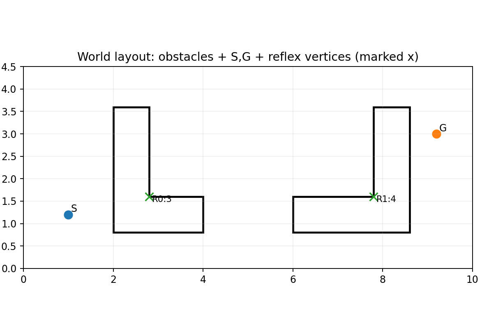
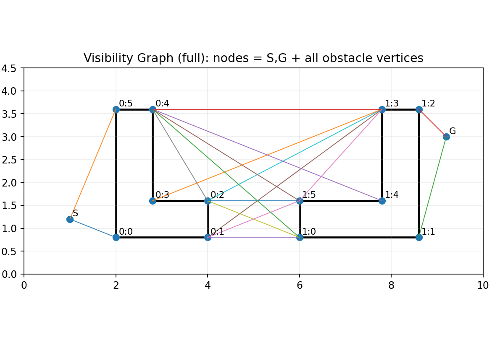
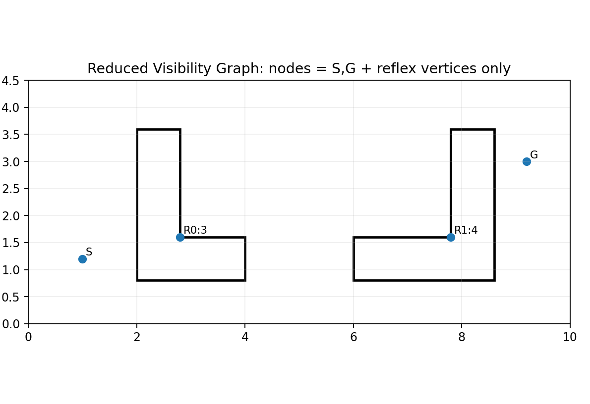
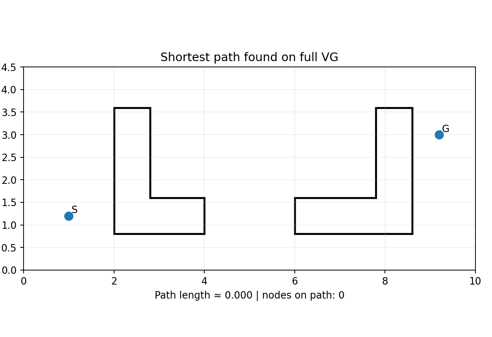
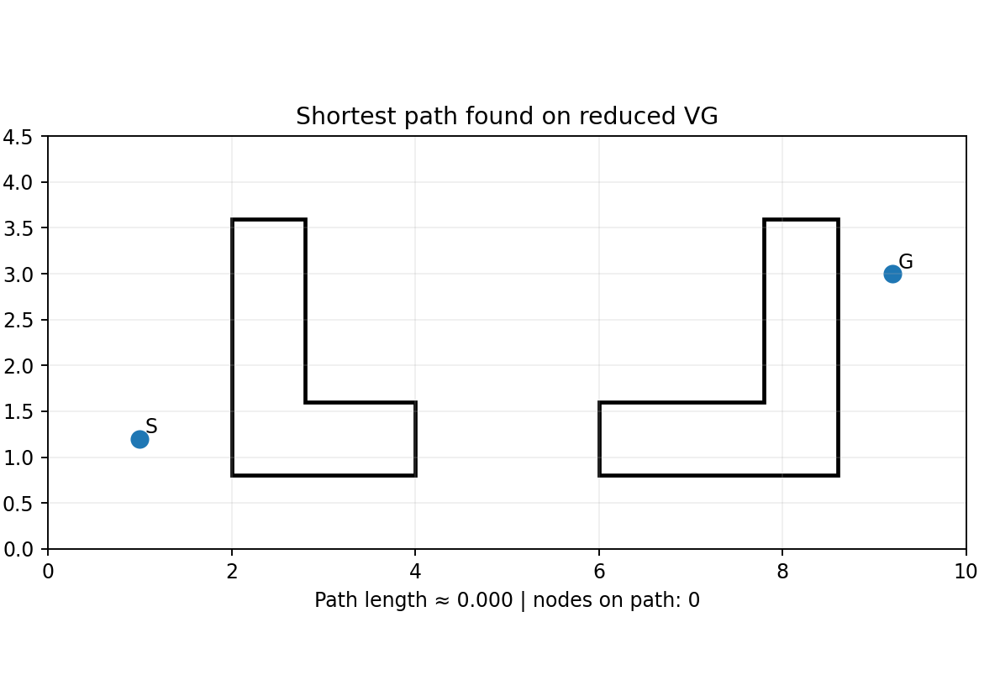

# Visibility Graph vs Reduced Visibility Graph — Image Walkthrough

Gói này chứa các ảnh được tạo trực tiếp từ Python để minh hoạ **Visibility Graph (VG)** và **Reduced Visibility Graph (RVG)** trong môi trường đa giác.

## Ký hiệu chung trong ảnh

- Vật cản: đa giác viền (không tô)
- **S**: start, **G**: goal
- Edge (cạnh đồ thị): các đoạn thẳng mảnh giữa các nút nhìn thấy nhau
- **Reflex vertex**: góc lõm (nội góc > 180°), đánh dấu bằng dấu **x** trong ảnh world

## Các ảnh trong gói

### World layout with reflex vertices

**File:** `01_world_reflex_vertices.png`

Hai vật cản đa giác (dạng chữ L) được vẽ bằng đường viền. Start S và Goal G là hai điểm cần nối. Các **reflex vertices** (góc lõm, nội góc > 180°) được đánh dấu bằng dấu **x** vì chúng là ứng viên quan trọng cho đường đi ngắn nhất trong môi trường đa giác.

### Full visibility graph

**File:** `02_visibility_graph_full.png`

Đồ thị nhìn thấy (VG) đầy đủ: **nút = {S,G} ∪ {tất cả đỉnh vật cản}**. Có cạnh giữa hai nút nếu đoạn thẳng nối chúng nằm trong free space (không cắt vào nội thất vật cản). Nhìn vào hình sẽ thấy số cạnh tăng nhanh vì rất nhiều cặp đỉnh có line-of-sight.

### Reduced visibility graph

**File:** `03_visibility_graph_reduced.png`

Đồ thị nhìn thấy rút gọn (RVG): **nút = {S,G} ∪ {reflex vertices}**. Vì đường đi ngắn nhất trong môi trường đa giác chỉ cần “đổi hướng” tại các **góc lõm**, nên bỏ các góc lồi thường vẫn giữ được nghiệm tối ưu nhưng giảm mạnh số nút/cạnh.

### Shortest path on full VG (Dijkstra)

**File:** `04_shortest_path_full.png`

Chạy Dijkstra trên VG đầy đủ (trọng số cạnh = khoảng cách Euclid). Đường polyline đậm là đường đi ngắn nhất tìm được. Các điểm trên đường là các nút (S/G hoặc đỉnh vật cản) mà thuật toán đi qua.

### Shortest path on RVG (Dijkstra)

**File:** `05_shortest_path_reduced.png`

Chạy Dijkstra trên RVG rút gọn. Nếu mô hình visibility và định nghĩa RVG phù hợp, đường đi tối ưu thu được sẽ **trùng chiều dài** (hoặc rất gần) so với VG đầy đủ, nhưng chi phí xây dựng/duyệt đồ thị thấp hơn do ít nút/cạnh hơn.

## Số liệu nhanh (từ lần chạy này)

- Full VG: nodes = 14, edges = 17

- Reduced VG: nodes = 4, edges = 0

- Shortest path length (full VG) ≈ 0.000

- Shortest path length (reduced VG) ≈ 0.000

> Nếu hai độ dài này lệch nhau đáng kể, nguyên nhân thường nằm ở: (1) tiêu chuẩn visibility quá bảo thủ/quá lỏng, (2) môi trường/định nghĩa RVG (chỉ dùng reflex) chưa đủ cho layout cụ thể, hoặc (3) cách xử lý “touching the boundary”.
