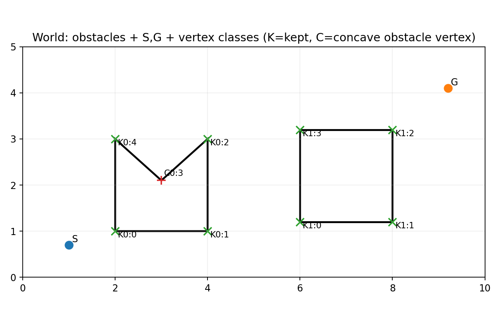
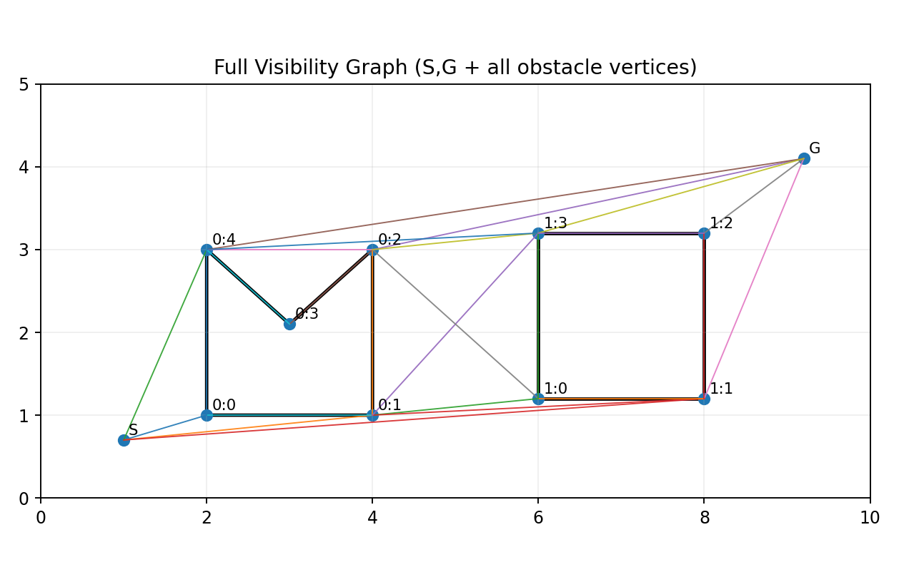
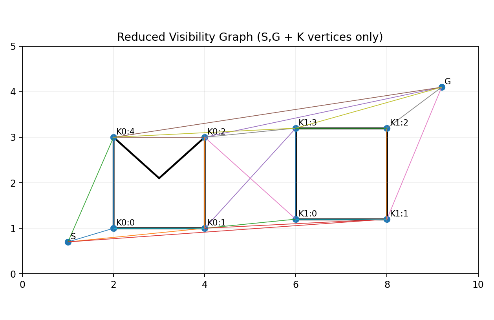
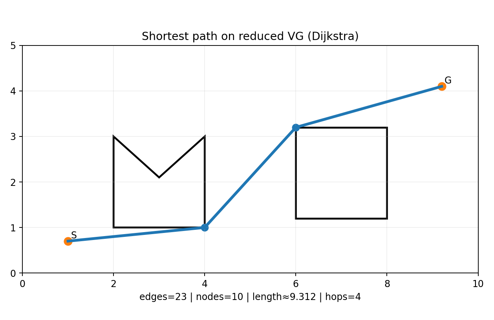
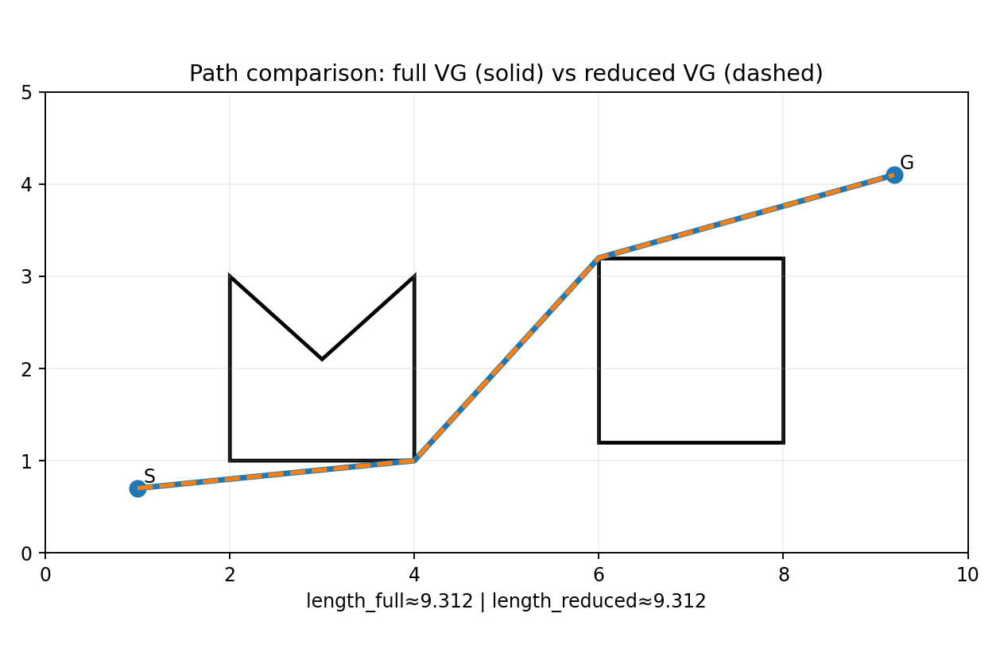

# Visibility Graph (VG) vs Reduced Visibility Graph (RVG) — Verified & Improved Demo

Gói này là phiên bản **đã chỉnh sửa theo phản hồi** (ví dụ từ Grok) và **làm rõ một điểm hình học rất dễ nhầm**: *“reflex vertices” phải được hiểu theo **biên free space**, không phải luôn là “góc lõm của obstacle” theo nội thất obstacle.*

## Nội dung trong gói

- `README.md` (file này)

- `01_world_vertex_classes.png`

- `02_full_visibility_graph.png`

- `03_reduced_visibility_graph.png`

- `04_shortest_path_full.png`

- `05_shortest_path_reduced.png`

- `06_path_comparison.png`

- `generate_visibility_graph_demo_v2.py` (script tái tạo toàn bộ ảnh)

---
## 1) Kết luận lý thuyết (đồng ý với feedback)

### Visibility Graph (VG)

- **Nodes**: $V = \{S, G\} \cup V_{\text{obs}}$ (với $V_{\text{obs}}$ là tập tất cả đỉnh obstacle)

- **Edges**: nối 2 nodes nếu đoạn thẳng giữa chúng có **line-of-sight** (không đi vào nội thất vật cản; có thể chạm biên tại vertices tuỳ quy ước)

- Thuộc tính chuẩn: đường đi ngắn nhất trong môi trường đa giác là một polyline có các “turns” tại **một tập con** của obstacle vertices.

### Reduced Visibility Graph (RVG)

**Ý chính đúng**: RVG giữ một tập con nhỏ các vertices nhưng vẫn (thường) chứa đường đi tối ưu.

**Điểm cần làm rõ (sửa nhẹ so với cách diễn đạt phổ biến):**

- Đường đi tối ưu chỉ cần “bẻ” tại các vertices có **góc $> 180^\circ$ nhìn từ phía free space** (reflex vertices của **biên free space**).

- Nếu obstacle polygon được cho theo CCW (nội thất obstacle ở bên trái cạnh), thì **reflex của free space** tương ứng với **đỉnh lồi của obstacle** (left turns, `cross > 0`).

- Ngược lại, **đỉnh lõm của obstacle** (concave / `cross < 0`) thường là **góc lồi đối với free space**, không phải điểm bắt buộc cho đường đi ngắn nhất.

> Vì vậy trong demo v2 này, RVG dùng tập **K-vertices** = các đỉnh lồi của obstacle (đánh dấu `K...`).

---
## 2) Minor implementation notes (theo feedback)

- Hàm `visible()` ở đây vẫn theo phong cách **conservative** (an toàn): cấm các đoạn cắt vào nội thất, và xử lý ‘touching boundary’ theo quy ước rõ ràng.

- Edge-case hiếm: nếu một đoạn đi *trùng hẳn* với một cạnh obstacle, các định nghĩa có thể khác nhau. Với shortest-path, điều này thường không ảnh hưởng vì đường tối ưu chỉ “chạm” ở vertices.

---
## 3) Số liệu từ lần chạy này

- Full VG: nodes = 11, edges = 25

- Reduced VG: nodes = 10, edges = 23

- Shortest path length (full VG) $\approx 9.312$

- Shortest path length (reduced VG) $\approx 9.312$

---
## 4) Image-by-image explanation

### World layout + vertex classes

**File:** `01_world_vertex_classes.png`

Vẽ môi trường với 2 vật cản. Các đỉnh được phân loại:
- **K** (marker x): các đỉnh *cần giữ* cho RVG theo định lý đường đi ngắn (tương ứng **reflex của biên free space**, hay **đỉnh lồi của obstacle**).
- **C** (marker +): các đỉnh lõm của obstacle (thường *không* cần làm điểm đổi hướng trong đường đi tối ưu).

### Full visibility graph (VG)

**File:** `02_full_visibility_graph.png`

VG đầy đủ: nút $= \{S,G\} \cup V_{\text{obs}}$. Cạnh tồn tại nếu đoạn thẳng giữa 2 nút có line-of-sight (không đi vào nội thất vật cản).

### Reduced visibility graph (RVG)

**File:** `03_reduced_visibility_graph.png`

RVG dùng tập nút nhỏ hơn: $\{S,G\} \cup K$. Tập $K$ tương ứng các điểm đổi hướng cần thiết cho đường đi ngắn nhất (đỉnh reflex của biên free space).

### Shortest path on full VG

**File:** `04_shortest_path_full.png`

Chạy Dijkstra trên VG đầy đủ (trọng số = khoảng cách Euclid). Đường đậm là đường đi ngắn nhất tìm được trong free space.

### Shortest path on reduced VG

**File:** `05_shortest_path_reduced.png`

Chạy Dijkstra trên RVG. Với định nghĩa RVG đúng (K-vertices), đường đi tối ưu thu được sẽ trùng/tiệm cận nghiệm từ VG đầy đủ, nhưng đồ thị nhỏ hơn.

### Path comparison (solid vs dashed)

**File:** `06_path_comparison.png`

So sánh trực quan: đường trên VG đầy đủ (nét liền) và RVG (nét đứt). Nếu RVG được xây đúng, hai đường thường trùng nhau hoặc sai khác rất nhỏ (do quy ước xử lý ‘touching boundary’ và tính bảo thủ của kiểm tra visibility).
